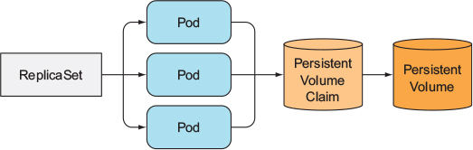
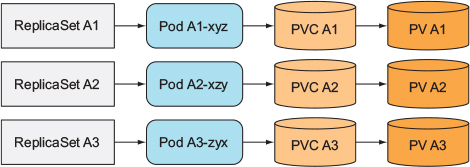
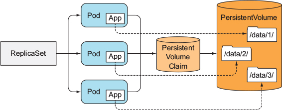
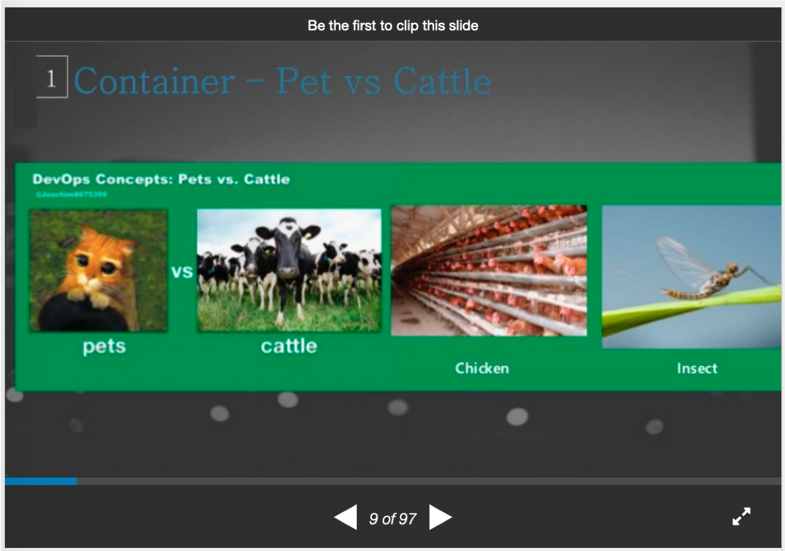
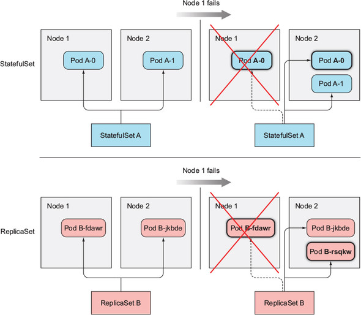
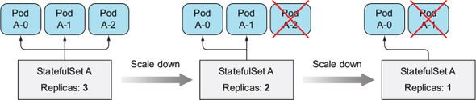
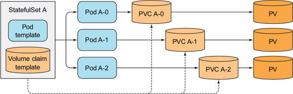
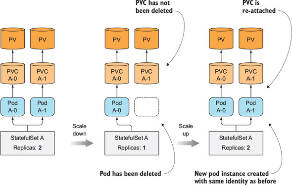
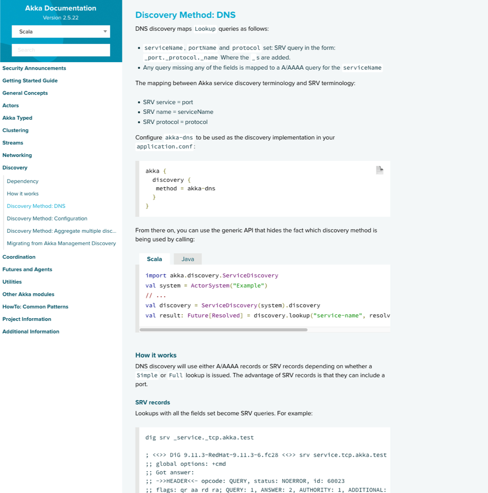

## 10장. StatefulSets: 상태 유지가 필요한 애플리케이션의 복제 배포하기

- Deploying stateful clustered applications
- Providing separate storage for each instance of a replicated pod 
- Guranteeing a stable name and hostname for pod replicas
- Starting and stopping pod replicas in a predicatabble order
- Deiscoverting peers throught DNS SRV records

### Replicating Stateful Pods



All Pods from the same ReplicaSet always use the same PersistentVolumeCalim and PersistentVolume, Because the reference to the claim 

--> 동일한 어플리케이션의 여러 인스턴스가 동시에 Volume의 같은 디렉토리/파일을 참조하면 데이터가 유지되지 않는다


#### Running multiple replicas with seperate sotrage for each



Creating multiple ReplicaSets - one for each pod with each ReplicaSet and each ReplicaSet's pod template referencing a dedicated PersistentVolumeClaim

--> X 말도 안돼, 누가 이렇게 써



어플리케이션에서 Downward API를 통해서 PodID 또는 PodName등의 구분자를 받아서 사용할려고 하는 Volume 아래에 Pod 마다 구분로 사용

##### Providing a stable identity for each pod

Pod는 언제든지 죽고 다시 만들어질수 있고, 그 때마다 새로운 hostname, IP등을 가지는데, 이때 예전 Pod가 가진 데이터에 새로운 네트워크 신분을 가지고 접근하게 되면 문제가 될수 있다 

구성원중 하나가 재조정될때 마다 어플리케이션 클러스터 전체가 재설정 된다

###### 예) akka cluster


[A four-node clustered actor system - akka cluster]


### StatefulSets

#### StatefulSets vs ReplicaSets (or ReplicationControllers)


[K8s beginner 2_advanced_ep02_201904221130_post ](https://www.slideshare.net/InhoKang2/k8s-beginner-2advancedep02201904221130post)by inho kang


#### Providing a stable network identity

StatefulSet은 ordinal index(zero-based)으로 Pod name, hostanme 그리고 stable storage 부여


Scaling down a StatefulSet always remove the pod with the highest ordinal index first


#### Providing stabble dedicated storage to each stateful instance

상태 유지가 필요한 pod instance마다 자신의 스토리가 필요하거나, 재생성되어도 예전의 스토리를 가질려면?

기본적으로 PVC는 Pod Name을 참조한다
```bash
```

A StatefulSet create both pods and PersistentVolumeClaims



* you're required to delete PVC manually to release the underlying PV

SatefulSets don't delete PersistentVolumeClaims when scaling down; then they reattach them when scaling back up



#### Understanding StatefulSet guarantees

Kubernetes에서는 Stateful Pod Instance는 절대로 같은 identity와 같은 PVC에 연결하지 않는다

### StatefulSet 사용하기

[PV]
```bash
$ gcloud compute disks create --size=1GiB --zone=us-west1-a pv-a
WARNING: You have selected a disk size of under [200GB]. This may result in poor I/O performance. For more information, see: https://developers.google.com/compute/docs/disks#performance.
Created [https://www.googleapis.com/compute/v1/projects/pa-jhwang/zones/us-west1-a/disks/pv-a].
NAME  ZONE        SIZE_GB  TYPE         STATUS
pv-a  us-west1-a  1        pd-standard  READY

New disks are unformatted. You must format and mount a disk before it
can be used. You can find instructions on how to do this at:

https://cloud.google.com/compute/docs/disks/add-persistent-disk#formatting


$ gcloud compute disks create --size=1GiB --zone=us-west1-b pv-b
$ gcloud compute disks create --size=1GiB --zone=us-west1-c pv-c
```

```yaml
kind: List
apiVersion: v1
items:
- apiVersion: v1
  kind: PersistentVolume
  metadata:
    name: pv-a
  spec:
    capacity:
      storage: 1Mi
    accessModes:
      - ReadWriteOnce
    persistentVolumeReclaimPolicy: Recycle
    gcePersistentDisk:
      pdName: pv-a
      fsType: nfs4
- apiVersion: v1
  kind: PersistentVolume
  metadata:
    name: pv-b
  spec:
    capacity:
      storage: 1Mi
    accessModes:
      - ReadWriteOnce
    persistentVolumeReclaimPolicy: Recycle
    gcePersistentDisk:
      pdName: pv-b
      fsType: nfs4
- apiVersion: v1
  kind: PersistentVolume
  metadata:
    name: pv-c
  spec:
    capacity:
      storage: 1Mi
    accessModes:
      - ReadWriteOnce
    persistentVolumeReclaimPolicy: Recycle
    gcePersistentDisk:
      pdName: pv-c
      fsType: nfs4  
```

```bash
persistentvolume/pv-a created
persistentvolume/pv-b created
persistentvolume/pv-c created
```

[statefulset.yml]
```yaml
apiVersion: v1
kind: Service
metadata:
  name: nginx
spec:
  clusterIP: None
  selector:
    app: nginx
  ports:
  - name: http
    port: 80

---
apiVersion: apps/v1beta1
kind: StatefulSet
metadata:
  name: nginx
spec:
  serviceName: nginx
  replicas: 2
  template:
    metadata:
      labels:
        app: nginx
    spec:
      containers:
      - name: nginx
        image: nginx
        ports:
        - name: http
          containerPort: 8080
        volumeMounts:
        - name: data
          mountPath: /var/data
  volumeClaimTemplates:
  - metadata:
      name: data
    spec:
      resources:
        requests:
          storage: 1Mi
      accessModes:
      - ReadWriteOnce
```

```bash
$ k apply -f -<<EOF
> apiVersion: apps/v1beta1
> kind: StatefulSet
> metadata:
>   name: nginx
> spec:
>   serviceName: nginx
>   replicas: 2
>   template:
>     metadata:
>       labels:
>         app: nginx
>     spec:
>       containers:
>       - name: nginx
>         image: nginx
>         ports:
>         - name: http
>           containerPort: 8080
>         volumeMounts:
>         - name: data
>           mountPath: /var/data
>   volumeClaimTemplates:
>   - metadata:
>       name: data
>     spec:
>       resources:
>         requests:
>           storage: 1Mi
>       accessModes:
>       - ReadWriteOnce
> EOF
statefulset.apps/nginx created
```

```bash
ubuntu@jumpbox:~$ k get po
NAME          READY   STATUS    RESTARTS   AGE
nginx-0       1/1     Running   0          35s
nginx-1       1/1     Running   0          19s
nginx-jcmv6   1/1     Running   0          10h
nginx-vlnvr   1/1     Running   0          10h
nginx-vv89d   1/1     Running   0          10h

ubuntu@jumpbox:~$ k get pvc
NAME           STATUS   VOLUME                                     CAPACITY   ACCESS MODES   STORAGECLASS   AGE
data-nginx-0   Bound    pvc-307ca6eb-6af3-11e9-8020-42010a000b0a   1Gi        RWO            standard       9m39s
data-nginx-1   Bound    pvc-3a147195-6af3-11e9-8020-42010a000b0a   1Gi        RWO            standard       9m23s

ubuntu@jumpbox:~$ k get pv
NAME                                       CAPACITY   ACCESS MODES   RECLAIM POLICY   STATUS      CLAIM                  STORAGECLASS   REASON   AGE
pv-a                                       1Mi        RWO            Recycle          Available                                                  11m
pv-b                                       1Mi        RWO            Recycle          Available                                                  11m
pv-c                                       1Mi        RWO            Recycle          Available                                                  11m
pvc-307ca6eb-6af3-11e9-8020-42010a000b0a   1Gi        RWO            Delete           Bound       default/data-nginx-0   standard                9m46s
pvc-3a147195-6af3-11e9-8020-42010a000b0a   1Gi        RWO            Delete           Bound       default/data-nginx-1   standard                9m30s
```

```bash
# Creating contents in the each pod instances
ubuntu@jumpbox:~$ k exec nginx-0 -it bash
root@nginx-0:~# echo "Hello nginx-0" > /var/data/readme
root@nginx-0:~# cat /var/data/readme
Hello nginx-0

ubuntu@jumpbox:~$ k exec nginx-1 -it -- sh -c 'echo "Hello nginx-1" > /var/data/readme'
ubuntu@jumpbox:~$ k exec nginx-1 -it -- sh -c 'cat /var/data/readme'
Hello nginx-1

# Deleting a stateful pod (nginx-0)
# A stateful pod may be rescheduled to a different node, but it retains the name, hostame and storage
ubuntu@jumpbox:~$ k delete po nginx-0
pod "nginx-0" deleted
ubuntu@jumpbox:~$ k get po
NAME          READY   STATUS              RESTARTS   AGE
nginx-0       0/1     ContainerCreating   0          2s
nginx-1       1/1     Running             0          30m
nginx-jcmv6   1/1     Running             0          11h
nginx-vlnvr   1/1     Running             0          11h
nginx-vv89d   1/1     Running             0          11h

ubuntu@jumpbox:~$ k exec nginx-0 -it -- sh -c 'cat /var/data/readme'
Hello nginx-0

```
```yaml
ubuntu@jumpbox:~$ k get po nginx-0 -o yaml
apiVersion: v1
kind: Pod
metadata:
  creationTimestamp: 2019-04-30T02:53:53Z
  generateName: nginx-
  labels:
    app: nginx
    controller-revision-hash: nginx-cb6b4fd6f
    statefulset.kubernetes.io/pod-name: nginx-0
  name: nginx-0
  namespace: default
  ownerReferences:
  - apiVersion: apps/v1
    blockOwnerDeletion: true
    controller: true
    kind: StatefulSet
    name: nginx
    uid: 307642b5-6af3-11e9-a027-42010a000b0b
  resourceVersion: "69677"
  selfLink: /api/v1/namespaces/default/pods/nginx-0
  uid: 307e4be5-6af3-11e9-8020-42010a000b0a
spec:
  containers:
  - image: nginx
    imagePullPolicy: Always
    name: nginx
    ports:
    - containerPort: 8080
      name: http
      protocol: TCP
    resources: {}
    terminationMessagePath: /dev/termination-log
    terminationMessagePolicy: File
    volumeMounts:
    - mountPath: /var/data
      name: data
    - mountPath: /var/run/secrets/kubernetes.io/serviceaccount
      name: default-token-hn42h
      readOnly: true
  dnsPolicy: ClusterFirst
  enableServiceLinks: true
  hostname: nginx-0
  nodeName: vm-8c6e3516-a151-4c73-4b32-8315a974aac9
  priority: 0
  restartPolicy: Always
  schedulerName: default-scheduler
  securityContext: {}
  serviceAccount: default
  serviceAccountName: default
  subdomain: nginx
  terminationGracePeriodSeconds: 30
  tolerations:
  - effect: NoExecute
    key: node.kubernetes.io/not-ready
    operator: Exists
    tolerationSeconds: 300
  - effect: NoExecute
    key: node.kubernetes.io/unreachable
    operator: Exists
    tolerationSeconds: 300
  volumes:
  - name: data
    persistentVolumeClaim:
      claimName: data-nginx-0
  - name: default-token-hn42h
    secret:
      defaultMode: 420
      secretName: default-token-hn42h
status:
  conditions:
  - lastProbeTime: null
    lastTransitionTime: 2019-04-30T02:53:56Z
    status: "True"
    type: Initialized
  - lastProbeTime: null
    lastTransitionTime: 2019-04-30T02:54:09Z
    status: "True"
    type: Ready
  - lastProbeTime: null
    lastTransitionTime: 2019-04-30T02:54:09Z
    status: "True"
    type: ContainersReady
  - lastProbeTime: null
    lastTransitionTime: 2019-04-30T02:53:56Z
    status: "True"
    type: PodScheduled
  containerStatuses:
  - containerID: docker://b6aae1be11d1aeed7be2e3d2912100168f12b7b534017abfa8e73eb3ae27be24
    image: nginx:latest
    imageID: docker-pullable://nginx@sha256:e71b1bf4281f25533cf15e6e5f9be4dac74d2328152edf7ecde23abc54e16c1c
    lastState: {}
    name: nginx
    ready: true
    restartCount: 0
    state:
      running:
        startedAt: 2019-04-30T02:54:08Z
  hostIP: 10.0.11.13
  phase: Running
  podIP: 10.200.46.7
  qosClass: BestEffort
  startTime: 2019-04-30T02:53:56Z
```

```yaml
ubuntu@jumpbox:~$ k get po nginx-0 -o yaml
apiVersion: v1
kind: Pod
metadata:
  creationTimestamp: 2019-04-30T03:24:07Z
  generateName: nginx-
  labels:
    app: nginx
    controller-revision-hash: nginx-cb6b4fd6f
    statefulset.kubernetes.io/pod-name: nginx-0
  name: nginx-0
  namespace: default
  ownerReferences:
  - apiVersion: apps/v1
    blockOwnerDeletion: true
    controller: true
    kind: StatefulSet
    name: nginx
    uid: 307642b5-6af3-11e9-a027-42010a000b0b
  resourceVersion: "72643"
  selfLink: /api/v1/namespaces/default/pods/nginx-0
  uid: 69ec83e5-6af7-11e9-8020-42010a000b0a
spec:
  containers:
  - image: nginx
    imagePullPolicy: Always
    name: nginx
    ports:
    - containerPort: 8080
      name: http
      protocol: TCP
    resources: {}
    terminationMessagePath: /dev/termination-log
    terminationMessagePolicy: File
    volumeMounts:
    - mountPath: /var/data
      name: data
    - mountPath: /var/run/secrets/kubernetes.io/serviceaccount
      name: default-token-hn42h
      readOnly: true
  dnsPolicy: ClusterFirst
  enableServiceLinks: true
  hostname: nginx-0
  nodeName: vm-8c6e3516-a151-4c73-4b32-8315a974aac9
  priority: 0
  restartPolicy: Always
  schedulerName: default-scheduler
  securityContext: {}
  serviceAccount: default
  serviceAccountName: default
  subdomain: nginx
  terminationGracePeriodSeconds: 30
  tolerations:
  - effect: NoExecute
    key: node.kubernetes.io/not-ready
    operator: Exists
    tolerationSeconds: 300
  - effect: NoExecute
    key: node.kubernetes.io/unreachable
    operator: Exists
    tolerationSeconds: 300
  volumes:
  - name: data
    persistentVolumeClaim:
      claimName: data-nginx-0
  - name: default-token-hn42h
    secret:
      defaultMode: 420
      secretName: default-token-hn42h
status:
  conditions:
  - lastProbeTime: null
    lastTransitionTime: 2019-04-30T03:24:07Z
    status: "True"
    type: Initialized
  - lastProbeTime: null
    lastTransitionTime: 2019-04-30T03:24:15Z
    status: "True"
    type: Ready
  - lastProbeTime: null
    lastTransitionTime: 2019-04-30T03:24:15Z
    status: "True"
    type: ContainersReady
  - lastProbeTime: null
    lastTransitionTime: 2019-04-30T03:24:07Z
    status: "True"
    type: PodScheduled
  containerStatuses:
  - containerID: docker://33ccd2431508c90c7ca8c221766b8411cd5e4640678e7a12e7a95c406d85e45d
    image: nginx:latest
    imageID: docker-pullable://nginx@sha256:e71b1bf4281f25533cf15e6e5f9be4dac74d2328152edf7ecde23abc54e16c1c
    lastState: {}
    name: nginx
    ready: true
    restartCount: 0
    state:
      running:
        startedAt: 2019-04-30T03:24:15Z
  hostIP: 10.0.11.13
  phase: Running
  podIP: 10.200.46.9
  qosClass: BestEffort
  startTime: 2019-04-30T03:24:07Z
```


#### Scaling a StatefulSet

```bash
ubuntu@jumpbox:~$ k scale sts nginx --replicas=3

ubuntu@jumpbox:~$ k get po -l app=nginx
NAME          READY   STATUS              RESTARTS   AGE
nginx-0       1/1     Running             0          19m
nginx-1       1/1     Running             0          49m
nginx-2       0/1     ContainerCreating   0          28s
nginx-jcmv6   1/1     Running             0          11h
nginx-vlnvr   1/1     Running             0          11h
nginx-vv89d   1/1     Running             0          11h
ubuntu@jumpbox:~$ k get po -l app=nginx
NAME          READY   STATUS    RESTARTS   AGE
nginx-0       1/1     Running   0          19m
nginx-1       1/1     Running   0          49m
nginx-2       1/1     Running   0          29s
nginx-jcmv6   1/1     Running   0          11h
nginx-vlnvr   1/1     Running   0          11h
nginx-vv89d   1/1     Running   0          11h

ubuntu@jumpbox:~$ k exec nginx-1 -it -- su -c 'cat /var/data/readme'
Hello nginx-1

ubuntu@jumpbox:~$ k exec nginx-2 -it -- su -c 'cat /var/data/readme'
cat: /var/data/readme: No such file or directory
command terminated with exit code 1

ubuntu@jumpbox:~$ k get pvc -l app=nginx
NAME           STATUS   VOLUME                                     CAPACITY   ACCESS MODES   STORAGECLASS   AGE
data-nginx-0   Bound    pvc-307ca6eb-6af3-11e9-8020-42010a000b0a   1Gi        RWO            standard       50m
data-nginx-1   Bound    pvc-3a147195-6af3-11e9-8020-42010a000b0a   1Gi        RWO            standard       50m
data-nginx-2   Bound    pvc-0f97838a-6afa-11e9-8020-42010a000b0a   1Gi        RWO            standard       69s

ubuntu@jumpbox:~$ k patch sts nginx -p '{"spec":{"replicas":2}}'
statefulset.apps/nginx patched

ubuntu@jumpbox:~$ k get pvc -l app=nginx
NAME           STATUS   VOLUME                                     CAPACITY   ACCESS MODES   STORAGECLASS   AGE
data-nginx-0   Bound    pvc-307ca6eb-6af3-11e9-8020-42010a000b0a   1Gi        RWO            standard       51m
data-nginx-1   Bound    pvc-3a147195-6af3-11e9-8020-42010a000b0a   1Gi        RWO            standard       51m
data-nginx-2   Bound    pvc-0f97838a-6afa-11e9-8020-42010a000b0a   1Gi        RWO            standard       2m39s
```

### Discovering Peers in a StatefulSet

peer discovery 

- Using the API sever
- DNS (Domain Name System) : A, CNAME, SRV(service) etc..

<pre>SRV record : A Service record is a specification of data in the DNS defining the location, i.e. the hostname and port number of servers for specified services(RFC 2782)

_service._proto.name. TTL class SRV priority weight port target.

# sample 
# _service._proto.name.  TTL   class SRV priority weight port target.
_sip._tcp.example.com.   86400 IN    SRV 10       60     5060 bigbox.example.com.
_sip._tcp.example.com.   86400 IN    SRV 10       20     5060 smallbox1.example.com.
_sip._tcp.example.com.   86400 IN    SRV 10       20     5060 smallbox2.example.com.
_sip._tcp.example.com.   86400 IN    SRV 20       0      5060 backupbox.example.com.
</pre>

Kubernetes creates SRV records to point to the hostnames of the pods backing a headless service

```bash
ubuntu@jumpbox:~$ k run -it --rm srvlookup --image=tutum/dnsutils bash
kubectl run --generator=deployment/apps.v1beta1 is DEPRECATED and will be removed in a future version. Use kubectl create instead.

If you don't see a command prompt, try pressing enter.

root@srvlookup-54d78c6bf6-48hbv:/#
root@srvlookup-54d78c6bf6-48hbv:/#
root@srvlookup-54d78c6bf6-48hbv:/# dig SRV nginx.default.svc.cluster.local

; <<>> DiG 9.9.5-3ubuntu0.2-Ubuntu <<>> SRV nginx.default.svc.cluster.local
;; global options: +cmd
;; Got answer:
;; ->>HEADER<<- opcode: QUERY, status: NOERROR, id: 23465
;; flags: qr aa rd; QUERY: 1, ANSWER: 5, AUTHORITY: 0, ADDITIONAL: 6
;; WARNING: recursion requested but not available

;; OPT PSEUDOSECTION:
; EDNS: version: 0, flags:; udp: 4096
;; QUESTION SECTION:
;nginx.default.svc.cluster.local. IN	SRV

;; ANSWER SECTION:
nginx.default.svc.cluster.local. 5 IN	SRV	0 20 80 nginx-0.nginx.default.svc.cluster.local.
nginx.default.svc.cluster.local. 5 IN	SRV	0 20 80 nginx-1.nginx.default.svc.cluster.local.

;; ADDITIONAL SECTION:
nginx-0.nginx.default.svc.cluster.local. 5 IN A	10.200.46.9
nginx-1.nginx.default.svc.cluster.local. 5 IN A	10.200.6.9

;; Query time: 14 msec
;; SERVER: 10.100.200.2#53(10.100.200.2)
;; WHEN: Tue Apr 30 04:05:49 UTC 2019
;; MSG SIZE  rcvd: 805

root@srvlookup-54d78c6bf6-48hbv:/#
```


https://doc.akka.io/docs/akka/current/discovery/index.html


### Understanding How StatefulSets deal with Node Failures

```bash
ubuntu@jumpbox:~$ k get no -o wide
NAME                                      STATUS   ROLES    AGE   VERSION   INTERNAL-IP   EXTERNAL-IP     OS-IMAGE             KERNEL-VERSION      CONTAINER-RUNTIME
vm-0f51a589-7168-45f5-7208-3e9f2feda121   Ready    <none>   13h   v1.13.5   10.0.11.14    35.197.86.68    Ubuntu 16.04.6 LTS   4.15.0-46-generic   docker://18.6.3
vm-8c6e3516-a151-4c73-4b32-8315a974aac9   Ready    <none>   13h   v1.13.5   10.0.11.13    35.247.72.83    Ubuntu 16.04.6 LTS   4.15.0-46-generic   docker://18.6.3
vm-fdbbc9ba-2ca5-4c00-413e-8c62ef0d81fc   Ready    <none>   13h   v1.13.5   10.0.11.15    35.247.64.127   Ubuntu 16.04.6 LTS   4.15.0-46-generic   docker://18.6.3
ubuntu@jumpbox:~$ k get po -o wide
NAME      READY   STATUS    RESTARTS   AGE   IP            NODE                                      NOMINATED NODE   READINESS GATES
nginx-0   1/1     Running   0          53m   10.200.46.9   vm-8c6e3516-a151-4c73-4b32-8315a974aac9   <none>           <none>
nginx-1   1/1     Running   0          83m   10.200.6.9    vm-0f51a589-7168-45f5-7208-3e9f2feda121   <none>           <none>
```

```bash
ubuntu@jumpbox:~$ bosh vms
Using environment '10.0.0.10' as client 'ops_manager'

Task 229
Task 230
Task 229 done

Task 230 done

Deployment 'pivotal-container-service-5fddda26e3eea524a4e2'

Instance                                                        Process State  AZ          IPs         VM CID                                   VM Type     Active
pivotal-container-service/a167f3db-3c68-4356-925b-0c0c800039c8  running        us-west1-a  10.0.10.10  vm-b9530c68-e968-4963-5405-fb6fec21a533  large.disk  true

1 vms

Deployment 'service-instance_95627d95-2fec-4810-ae3f-7b13f1a7989c'

Instance                                     Process State       AZ          IPs         VM CID                                   VM Type      Active
master/208bc333-6869-4050-aec0-d513bdef896c  running             us-west1-b  10.0.11.11  vm-88f0b063-3991-449a-7989-83ab6e182a81  medium.disk  true
master/5ada8ae5-c861-47c4-a63a-2ff1d57506a1  running             us-west1-a  10.0.11.10  vm-28dc7787-efeb-435d-472e-0c5315e6e1bc  medium.disk  true
master/f89619d1-339c-48ef-8ecd-81b44f946ca9  running             us-west1-c  10.0.11.12  vm-4d8b8e8f-7dc4-4bf5-5679-10ca19838210  medium.disk  true
worker/7588cf55-43b5-491c-a7bc-de663f6df311  running             us-west1-c  10.0.11.15  vm-fdbbc9ba-2ca5-4c00-413e-8c62ef0d81fc  medium.disk  true
worker/d657ba4f-9071-4a67-a5dd-fb93aa236d5e  unresponsive agent  us-west1-b  10.0.11.14  vm-0f51a589-7168-45f5-7208-3e9f2feda121  medium.disk  true
worker/feef8950-a8e3-4148-bf2f-9ec739945077  running             us-west1-a  10.0.11.13  vm-8c6e3516-a151-4c73-4b32-8315a974aac9  medium.disk  true

6 vms

Succeeded
```

### Summary

- Give replicated pods individual storage
- Provide a stable identity to a pod
- Create a StatefulSet and a corresponding headless governing Service
- Scale and update a StatefulSet
- Discover other members of the StatefulSet through DNS
- Connect to other members through their host names
  Forcibly delete stateful pods


