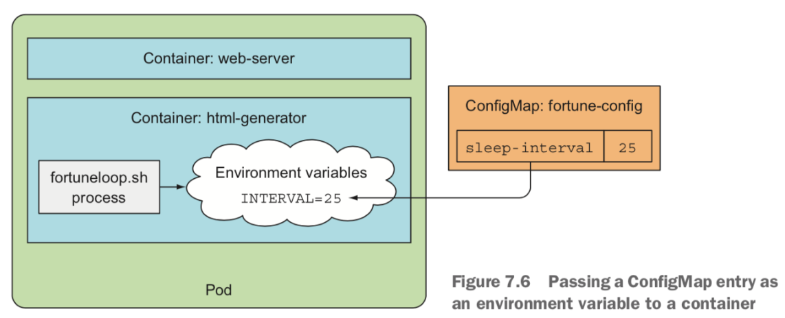
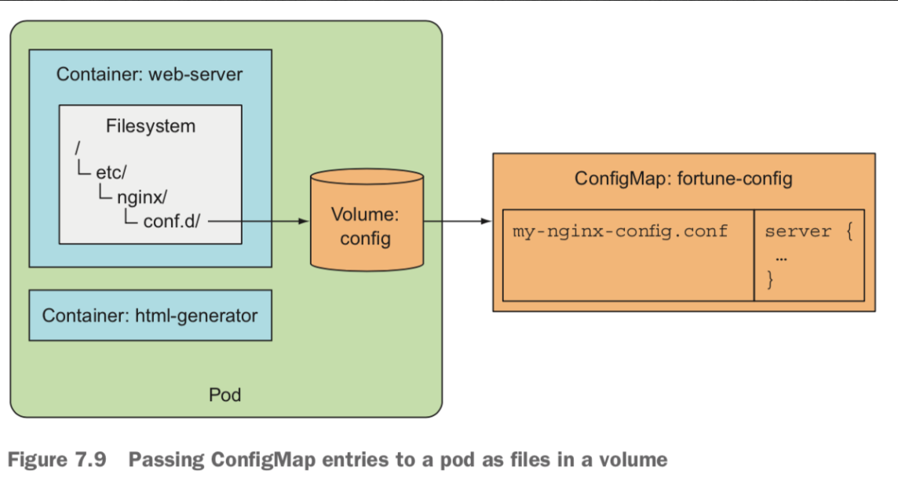
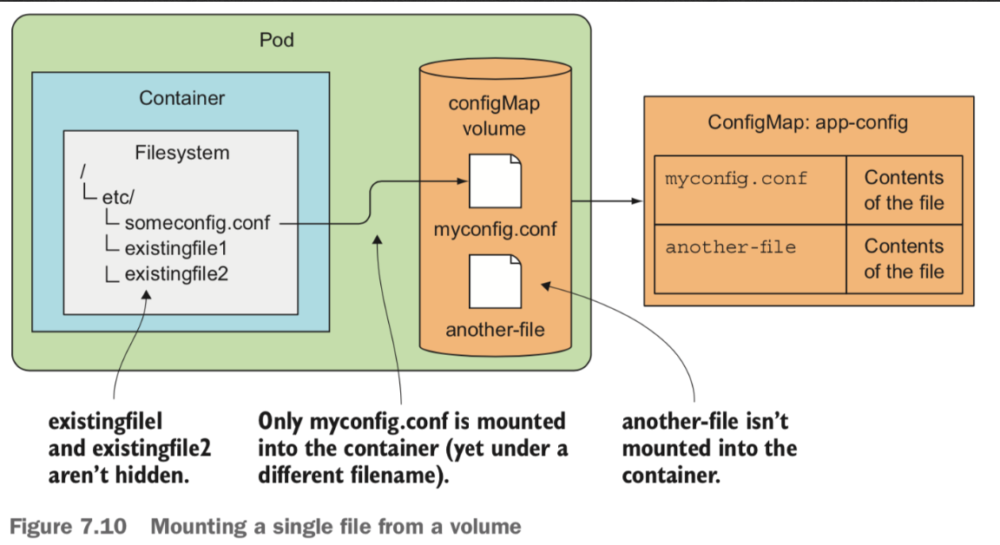

# ConfigMaps and Secrets

Application 설정을 변경할때는 일반적으로 **커맨드라인에 인자로 전달**하는데, 전달해야할 옵션이 많아지면 **파일 형태로 전달** 한다.
Kubernetes에서는 이러한 일반적인 방법으로 설정을 관리할 수 있도록 ConfigMap이라는 것을 제공해준다.

## ConfigMaps?
`ConfigMap`은 Application에서 필요한 설정을 Kubernetes 리소스로 만들어서, Kubernetes cluster 어디서든 어떤 형태로든지(커맨드라인 or 환경변수 or 파일 마운트) 사용할 수 있게 해준다.
또한 설정이 변경되었다고 하더라도, Application을 재배포하지 않아도 된다.  

## Secrets?
- credential이나 private encryption key같이 민감한 정보들을 저장하기 위해서는 special한 방법이 필요한데 이것을 위해서 Kubernetes에서는 `Secrets`라는 것을 제공한다.


## Configure a Configuration 
ConfigMap을 사용하지 않더라도, (Container환경에서) Application에 대한 설정을 다음과 같이 할 수 있을 것이다.
- 커맨드라인 실행시 설정을 인자로 전달
- 컨테이너에 환경변수로 설정을 주입
- 컨테이너 내에서 볼륨 마운트하여 설정 파일에 접근

### 커맨드라인 실행시 설정을 인자로 전달
```console
$ docker run <image> <arguments> 
```
  - 커맨드라인에서는 command와 arguments의 조합으로 실행되는데, 
  - Dockerfile에서도 `ENTRYPIONT`, `CMD`와 같은 instruction을 통해서 arguments에 들어갈 내용을 전달할 수 있다.

#### ENTRYPOINT vs CMD
- ENTRYPOINT : container가 시작될때 실행될 것들을 정의한다.
- CMD : ENTRYPOINT에 전달할 arguments들을 정의한다.
  - CMD를 통해서 docker image가 실행될 커맨드를 정의하기도 하지만, 올바른 방법은 ENTRYPOINT를 사용해야한다.
  - 혹은 default arguments를 정의할때 사용할 수 있다.
  
```dockerfile
# use ENTRYPOINT
FROM ubuntu
ENTRYPOINT ["echo", "hello kubenetes"]
```
```dockerfile
# use CMD
FROM ubuntu
CMD ["echo", "hello kubenetes"]
```
  - 위 두 Dockerfile을 가지고 아래와 같은 docker run을 실행한다면?
  
```console
$ docker build -t example .
$ docker run example echo world
```
  - ENTRYPOINT를 사용하는 경우는 
    - 설정된 echo "hello kubernetes"가 실행되며, 커맨드라인에 전달된 arguments들이 전달된다.
    - 따라서 최종적으로 `"hello kubernetes world"`가 출력될 것이다.
  - CMD를 사용할 경우는
    - CMD instruction으로 설정된 부분이 무시되고, 커맨드라인에 전달된 arguments가 실행된다.
    - 따라서 `"world"`만 출력될 것이다.
  - Dockerfile에서 ENTRYPOINT, CMD 둘다 사용할 경우?
    - 기본적으로 ENTRYPOINT만 실행되지만
    - docker run 실행시 argument가 없을 경우에, CMD로 설정한 값들은 ENTRYPOINT의 default argument로 전달된다.   
  
```yaml
kind: pod
spec: 
    containers:
    - image: some/image
      command: ["/bin/command"]
      args: ["arg1", "arg2", "arg3"]
```
  - Kubernetes에서는 위처럼 Dokerfile에서의 ENTRYPOINT를 command로, CMD를 args 필드로 사용한다.
  - 위처럼 Kubernetes spec에 command와 args가 정의되어 있다면, Dockerfile에서 설정한 ENTRYPOINT와 CMD는 override된다.
  - 위 spec으로 pod을 실행시키고 나서, 재시작/재실행 없이 값을 업데이트할 수는 없다. 

#### shell form vs exec form
위에서 설명한 Dokerfile의 ENTRYPOINT, CMD나 Kubernetes에서의 command, args와 같은 필드를 통해서 정의한 커맨드 및 인자에 대해서 두가지 form으로 사용이 가능하다.

- shell form : `ENTRYPOINT echo hello`
  - `/bin/sh -c`의 subcommand로  `echo`가 실행된다.
  - 이 경우 `echo`라는 프로세스가 signal을 수신하지 못하고, `/bin/sh`가 받게된다. 
  - 즉, PID 1은 `/bin/sh`가 가지게된다. (`ps` 명령으로 확인 가능)
- exec form : `ENTRYPOINT ["echo", "hello"]`
  - 전달되는 _excutable_ `echo`가 바로 실행되며, 이 _excutable_ 이 PID 1번을 달게 된다.
  - 따라서 이 프로세스가 unix signal을 받게 된다.
    - `docker stop <container>` 명령을 통해서 `SIGTERM` signal을 수신할 수 있다.
    - shell form에서 위 커맨드(`docker stop`)가 실행된다면, 일정 timeout 뒤에 `SIGKILL` signal을 수신하게 된다.  

- exec form을 사용을 권장함
  - shell process는 필요없고
  - excutable이 `SIGTERM` 같은 signal을 수신해서 어떤 cleanup 작업(stop apache 등)을 수행할 수도 있다.
  
#### Fortune Application with cmd args
```bash
#!/bin/bash
# fortuneloop.sh
trap "exit" SIGINT
INTERVAL=$1
echo refresh fortune every $INTEVAL sec
mkdir -p /var/htdocs
while :
do
    /usr/games/fortune > /var/htdocs/index.html
    sleep $INTERVAL
done
```
  - 인자인 INTERVAL의 값을 전달받아서 해당 시간동안 delay를 발생시키면서 fortune을 가져와서 html파일로 저장하는 프로그램이다.

```dockerfile
FROM ubuntu
RUN apt-get update ; apt-get -y install fortune
ADD fortuneloop.sh /bin/fortuneloop.sh
ENTRYPOINT ["/bin/fortuneloop.sh"]
CMD["10"]
```
  - docker run 커맨드에 의해 ENTRYPOINT 부분이 실행되며, CMD에서는 default 인자를 설정한 것이다.

```console
$ docker run -it docker.io/luksa/fortune:args
=> CMD에 설정된 default argment인 10초로 실행됨 
$ docker run -it docker.io/luksa/fortune:args 15
=> 커맨드라인으로 전달된 argment인 15초 주기로 실행
```

```yaml
apiVersion: v1
kind: Pod
metadata:
    name: fortune2s
spec: 
    containers:
    - image: luksa/fortune:args
      name: fortune-generator
      args: ["2"]
      volumeMounts:
      - name: html
        mountPath: /var/htdocs
```
  - Kubernetes에서는 위처럼 인자를 전달할 수 있다.
  

### 컨테이너에 환경변수로 설정을 주입
컨테이너에 환경변수를 명시해둘 수 있고, Pod에 환경변수를 설정하고 컨테이너마다 상속받을 수 있다.
Note : 커맨드라인에서처럼 Pod이 생성되고 나서 환경변수를 업데이트할 수 없다.

#### Fortune Application with environment variables
```bash
#!/bin/bash
# fortuneloop.sh
trap "exit" SIGINT
# INTERVAL=$1 => 이 부분만 삭제하면 
echo refresh fortune every $INTEVAL sec
mkdir -p /var/htdocs
while :
do
    /usr/games/fortune > /var/htdocs/index.html
    sleep $INTERVAL
done
```
  - 환경변수를 사용하기 위해서는 argument로부터 변수를 할당하는 부분만 삭제하면 된다.

```yaml
kind: Pod
spec: 
    containers:
    - image: luksa/fortune:env
      name: html-generator
      env:
      - name: INTERVAL
        value: "30"
      - name: INTERVAL_SECOND
        value: "$(INTERVAL)0"
```
  - 위 설정의 경우 Pod Level의 환경변수를 설정한 것이다.
  - 또한 쿠버네티스는 자동으로 동일 namespace의 각 서비스에게 환경변수를 노출시켜준다.


## Configure a ConfigMap 
Kubernetes에서 configuration을 분리할 수 있는 옵션을 제공해주는 구분된 객체가 있는데 그것이 바로 ConfigMap이다.
ConfigMap은 key/value pair로 구성되어 있으며, value는 간단한 literals도 가능하고, 여러 많은 정보를 담고있는 config file일 수도 있다.

```go
// https://github.com/kubernetes/kubernetes/blob/master/pkg/apis/core/types.go#L4543
type ConfigMap struct {
	metav1.TypeMeta
	// +optional
	metav1.ObjectMeta

	// Data contains the configuration data.
	// Each key must consist of alphanumeric characters, '-', '_' or '.'.
	// Values with non-UTF-8 byte sequences must use the BinaryData field.
	// The keys stored in Data must not overlap with the keys in
	// the BinaryData field, this is enforced during validation process.
	// +optional
	Data map[string]string

	// BinaryData contains the binary data.
	// Each key must consist of alphanumeric characters, '-', '_' or '.'.
	// BinaryData can contain byte sequences that are not in the UTF-8 range.
	// The keys stored in BinaryData must not overlap with the ones in
	// the Data field, this is enforced during validation process.
	// Using this field will require 1.10+ apiserver and
	// kubelet.
	// +optional
	BinaryData map[string][]byte
}
```
  - ConfigMap타입의 정의 부분을 살펴보면, string data뿐만 아니라 byte 타입인 binary data까지 저장할 수 있음을 알 수 있다.

### Creating a ConfigMap
이전에 사용했던 INTERVAL이라는 환경 변수를 어떻게 ConfigMap으로 만들 수 있는지 살펴보자.

#### `--from-literal` 옵션을 사용하여 생성
```console
$ kubectl create configmap fortune-config --from-literal=sleep-interval=25
``` 
  - `kubectl create configmap`이라는 커맨드로 ConfigMap을 생성한다.
  - 위에서는 `fortune-config`라는 이름의 ConfigMap을 생성했고, `--from-literal` 라는 옵션을 사용해서 `key=value`형태의 map 데이터를 전달했다.
    - 이때 `key`는 alphanumeric characters, '-', '_' or '.' 로만 구성할 수 있다고 하는데...
    - 공식 문서에서의 표현 : [`Each key must consist of alphanumeric characters, '-', '_' or '.'.`](https://github.com/kubernetes/kubernetes/blob/master/pkg/apis/core/types.go#L4549)  
      - 소스레벨에서 살펴보면, [IsConfigMapKey](https://github.com/kubernetes/kubernetes/blob/6902f3112d98eb6bd0894886ff9cd3fbd03a7f79/staging/src/k8s.io/apimachinery/pkg/util/validation/validation.go#L337)라는 메소드에서 (`[-._a-zA-Z0-9]+`)[https://github.com/kubernetes/kubernetes/blob/6902f3112d98eb6bd0894886ff9cd3fbd03a7f79/staging/src/k8s.io/apimachinery/pkg/util/validation/validation.go#L332]와 같은 정규표현식으로 검증한다.  

#### `--from-literal` 옵션 여러개 사용 가능
```console
$ kubectl create configmap fortune-config --from-literal=sleep-interval=25 --from-literal=wakeup-interval=30
``` 
  - 위의 ConfigMap 정의처럼, map을 사용하였으므로 여러 key-value pair를 받아서 `entries`를 생성할 수 있다.

```console
$ kubectl get configmap fortune-config -o yaml
apiVersion: v1
kind: ConfigMap
data:
  sleep-interval: "25"
  wakeup-interval: "30"
metadata:
  creationTimestamp: 2019-04-29T16:35:04Z
  name: fortune-config
  namespace: default
  resourceVersion: "2288467"
  selfLink: /api/v1/namespaces/default/configmaps/fortune-config
  uid: bdcec7a4-6a9c-11e9-a0f9-025000000001
```
  - 위에서 생성된 ConfigMap 객체를 살펴보면 `data` attribute 아래에 설정한 key-value의 `entries`를 확인할 수 있다.

#### `yaml`파일로 생성 
```console
$ kubectl apply -f fortune-config.yaml  
```
  - 다른 Kubernetes 객체들과 마찬가지로 yaml파일로부터 생성 가능하다.

#### `파일`, `디렉토리`를 지정하여 생성
```console
$ kubectl create configmap my-config --from-file=config-file.conf
$ kubectl create configmap my-config --from-file=customkey=config-file.conf
$ kubectl create configmap my-config --from-file=/path/to/dir
```
  - 특정 configuration file의 path를 지정하면, 해당 파일내의 key-value map 데이터를 그대로 취한다.
  - 또한 top level의 key에 value로 file을 지정할 수 있다.
  - 특정 path를 지정하여 path내의 모든 파일을 import시킬 수 있다.
    - 이 경우 파일 이름이 key가 되고, 파일의 내용이 value가 된다.
    
### ConfigMap as Environment variables

```yaml
apiVersion: v1
kind: Pod
metadata:
  name: fortune-env-from-configmap
spec: 
    containers:
    - image: luksa/fortune:env
      env:
      - name: INTERVAL
        valueFrom:
          configMapKeyRef:
            name: fortune-config
            key: sleep-interval
```
  - `INTERVAL`이라는 환경변수를 설정하는데, `valueFrom`을 이용해서 `configMapKeyRef`를 명시해서
  - 또한 사용할 ConfigMap의 이름을 `fortune-config` 지정했고, 참조할 값의 key를 `sleep-interval`으로 명시했다.




### ConfigMap from File
ConfigMap을 파일로 container에 expose시키기 위해서는 `configMap volume`이라는 volume type을 사용해야한다.
configMap volume은 ConfigMap의 각각의 entry를 파일로 expose시켜준다.

```console
# my-nginx-config.conf
server {
  listen        80;
  server_name   www.kubia-example.com;
  
  gzip on;
  gzip_type text/plain application/xml;
  location / {
    root    /usr/share/nginx/html;
    index   index.html index.htm;
  }
}
```
```console
$ kubectl delete configmap fortune-config
$ kubectl create configmap fortune-config --from-file=my-nginx-config.conf
$ kubectl get configmap fortune-config -o yaml
apiVersion: v1
data:
  my-nginx-config.conf: "server {\n  listen        80;\n  server_name   www.kubia-example.com;\n
    \ \n  gzip on;\n  gzip_type text/plain application/xml;\n  location / {\n    root
    \   /usr/share/nginx/html;\n    index   index.html index.htm;\n  }\n}\n"
kind: ConfigMap
metadata:
  creationTimestamp: 2019-04-30T01:04:10Z
  name: fortune-config
  namespace: default
  resourceVersion: "2294079"
  selfLink: /api/v1/namespaces/default/configmaps/fortune-config
  uid: dce8fb9b-6ae3-11e9-a0f9-025000000001
```
  - 파일로부터 ConfigMap을 생성하기 위해서는, `--from-file` 옵션으로 파일을 지정하면 된다.
  - 이렇게 ConfigMap을 만들게 되면, 파일의 이름이 key가 되고, 파일의 내용이 value가 된다.
  - 주의 : `--from-file` 옵션의 경우 `kubectl create`로 시작하는 커맨드에서만 사용가능하다. (그래서 위 예제에서는 `kubectl delete` 커맨드로 먼저 생성해둔 ConfigMap을 삭제함)
  - 참고로 (위의 결과에는 없지만) yaml을 작성시 `|`(파이프라인 문자)를 사용해서 multi line value를 할당할 수 있다.  


### ConfigMap from Volume
ConfigMap의 이름으로 참조하는 volume을 만들어서 마운트해서 사용할 수 있다.

#### ConfigMap으로부터 volume을 생성해서 마운트



```yaml
apiVersion: v1
kind: Pod
metadata:
  name: fortune-configmap-volume
spec:
  containers:
  - image: nginx:alpine
    name: web-server
    volumeMount: 
    ...
    - name: config
      mountPath: /etc/nginx/conf.d
      readOnly: true
    ...
  volumes:
  ...
  - name: config
    configMap:
      name: fortune-config
``` 

#### ConfigMap의 특정 Entry를 선택적으로 expose
 ```yaml
...
  volumes:
  - name: config
    configMap:
      name: fortune-config
      items: 
      - key: my-nginx-config.conf
        path: gzip.conf
``` 
  - 위처럼 `items`라는 attribute를 통해서, 원하는 entries를 `path`에 명시한 파일 이름으로 expose할 수 있다.
  - 여기까지 실행이 되었다면, `/etc/nginx/conf.d` 디렉토리 아래는 기존 파일들은 숨겨지고 `gzip.conf`라는 파일만 존재하게 된다.

#### Mounting each ConfigMap's entries
Volume 마운트할 경우 기존의 디렉토리에 존재했던 파일들은 숨겨져버린다.
따라서 volume 전체를 마운트하기보다는 원하는 ConfigMap entries만 각각 파일 혹은 디렉토리로 마운트해서 사용하는 방법을 알아보자.



```yaml
spec:
  containers:
  - image: some/image
    volumeMounts:
    - name: myvolume
      mountPath: /etc/someconfig.conf
      subPath: myconfig.conf
```
  - mountPath : 어떤 파일 혹은 어떤 디렉토리의 이름으로 마운트할 것인지 명시
  - subPath : 어떤 volume 타입이더라도 전체 volume을 마운트하지 않고, 특정 파일이나 디렉토리만 마운트 해준다.

### ConfigMap의 reload
volume을 통해서 ConfigMap을 사용하게 되면, pod이나 container에 대한 재생성/재시작 없이 configuration 변경이 가능하다.
하지만 해당 configuration을 reload 할지 말지는 Application의 정책이지, Kubernetes가 이를 보장해주지는 않는다.

#### ConfigMap atomic update
```console
$ kubectl exec -it fortune-configmap-volume -c web-server -- ls -lA /etc/nginx/conf.d
total 4
drwxr-xr-x  ... 12:15 ..4984_09_04_12_15_06.865837643
lrwxrwxrwx  ... 12:15 ..data -> ..4984_09_04_12_15_06.865837643
lrwxrwxrwx  ... 12:15 my-nginx-config.conf -> ..data/my-nginx-config.conf
lrwxrwxrwx  ... 12:15 sleep-interval -> ..data/sleep-interval
```
  - 실제 ConfigMap의 저장은 위처럼 심볼릭 링크로 걸려있다.
    - `..4984_09_04_12_15_06.865837643` : `/etc/nginx/conf.d` 디렉토리에 로드된 ConfigMap이 저장되있는 디렉토리
    - `..data` : ConfigMap이 저장된 디렉토리의 심볼릭 링크이다.
      - atomic update를 보장하기 위해서
        - ConfigMap이 변경되면 기존(`..4984_09_04_12_15_06.865837643`)과 다른 `New 디렉토리`를 생성하고
        - `New 디렉토리` 내에 각 Entries(`my-nginx-config.conf`, `sleep-interval`)를 생성/변경하고
        - `..data`의 심볼릭 링크를 `New 디렉토리`로 싹 변경해버린다. 


## Configure Secrets
```go
// https://github.com/kubernetes/kubernetes/blob/master/pkg/apis/core/types.go#L4424
type Secret struct {
	metav1.TypeMeta
	// +optional
	metav1.ObjectMeta

	// Data contains the secret data. Each key must consist of alphanumeric
	// characters, '-', '_' or '.'. The serialized form of the secret data is a
	// base64 encoded string, representing the arbitrary (possibly non-string)
	// data value here.
	// +optional
	Data map[string][]byte

	// Used to facilitate programmatic handling of secret data.
	// +optional
	Type SecretType
}

const MaxSecretSize = 1 * 1024 * 1024

type SecretType string
```

Secrets는 ConfigMap과 구현과 사용방법이 거의 동일하다. 
Secrets = Secure(ConfigMap)
 - Secrets는 각 Pod에서 참조되고, Secrets에 접근하길 원할때 노드에 Secrets을 배포해준다.
 - 또한 Secrets을 노드의 메모리에만 올리고 pysical storage에 저장하지 않는다.

#### Secrets vs ConfigMap
```console
$ kubectl get secret fortune-hhtps -o yaml
apiVersion: v1
data:
  foo: YmFycg==
  https.cert: Ls0tLs1CRUdJTiBDRV...
  https.key: Ls0tLs1CRUdJTiBSU0E...
```
```console
$ kubectl get configmap fortune-config -o yaml
apiVersion: v1
data:
  my-nginx-config.conf: "server {\n  listen        80;\n  server_name   www.kubia-example.com;\n
    \ \n  gzip on;\n  gzip_type text/plain application/xml;\n  location / {\n    root
    \   /usr/share/nginx/html;\n    index   index.html index.htm;\n  }\n}\n"
kind: ConfigMap
...
```
  - Secrets의 entries의 각 values들은 기본적으로 `base64 encoded string`이다.
    - base64 encoding을 사용하므로 binary data에 대해서도 저장이 가능하다. (하지만 Max size = [`1MB`](https://github.com/kubernetes/kubernetes/blob/master/pkg/apis/core/types.go#L4441))
  - 또한 모든 데이터가 sesitive한것을 아닐 수 있기때문에, `stringData`라는 attribute를 통해서 `base64 ecodeded`되지 않은 데이터를 저장할 수도 있다.
    - 하지만 `stringData`는 `writeOnly`이다. 
    - `kubectl get -o yaml` 커맨드를 통해서 Secrets을 YAML로 읽어드리면, `stringData` 필드는 보이지 않고, `data` 필드 아래에 `base64 encoded`된 상태로 보일 것 이다.
      - 위에서 Secret 정의부분에서 살펴봤듯이 `stringData`라는 필드는 없다.
  - `kubectl create secret secret-name` 커맨드로 직접 Secrets을 생성할 수도 있다.

#### volume 마운팅도 ConfigMap과 비슷
```yaml
apiVersion: v1
kind: Pod
spec:
  containers:
  - image: luksa/fortune:env
    volumeMounts:
    - name : certs
      mountPath: /etc/nginx/certs/
      readOnly: true
    ...
    volumes:
    - name: certs
      secret: 
        secretName: fortune-https
```
  - 위에서는 ConfigMap처럼 환경변수로 주입하진 않았고, volume으로 생성해둔 secret을 마운트만 했다.


#### Secrets in-memory
`/etc/nginx/certs`라는 디렉토리로 secret volume을 마운트해서 파일(certificate와 private key)을 전달했는데,
이 secret volume에서는 secret 파일들을 저장하기 위해서 tmpfs라는 in-memory 파일시스템을 사용한다.

```console
$ kubectl exec fortune-https -c web-server -- mount | grep certs
tmpfs on /etc/nginx/certs type `tmpfs` (ro,relatime)
```

#### Secrets? ConfigMap?
- non-seisitive, plain configuration data => ConfigMap
- sensitive data => Secrets
- 만약 sensitive와 no-sensitive데이터 모두 저장할길 원한다면 => Secrets (as File)


### Image pull Secrets
아마도 Secrets을 사용하는 가장 대표적인 예가 Dockerhub같은 곳(private container image registry)에서 이미지를 pull할때 사용하는 것이다.

#### docker-registry secret
```console
$ kubectl create secret docker-registry mydockerhubsecret \
  --docker-username=myusername --docker-password=password
  --docker-email=my@email.com
  
secret/mydockerhubsecret created
```

```yaml
$ kubectl get secret mydockerhubsecret -o yaml
apiVersion: v1
data:
  .dockerconfigjson: eyJhdXRocyI6eyJodHRwczovL2luZGV4LmRvY2tlci5pby92MS8iOnsidXNlcm5hbWUiOiJteXVzZXJuYW1lIiwicGFzc3dvcmQiOiJwYXNzd29yZCIsImF1dGgiOiJiWGwxYzJWeWJtRnRaVHB3WVhOemQyOXlaQT09In19fQ==
kind: Secret
metadata:
  creationTimestamp: 2019-04-30T04:16:13Z
  name: mydockerhubsecret
  namespace: default
  ...
type: kubernetes.io/dockerconfigjson
```
  - 위처럼 `data` 하위에 `.dockerconfigjson`라는 key에 `base64 encoded`된 값이 들어가는 것을 확인할 수 있다.
  - 이 필드의 값은 `~/.docker/config.json`에 있는 파일 대신 쓰이게되는데, 이 파일은 `docker login` 커맨드 실행시 생기는 파일이다.

```python
import base64
base64.b64decode(b'eyJhdXRocyI6eyJodHRwczovL2luZGV4LmRvY2tlci5pby92MS8iOnsidXNlcm5hbWUiOiJteXVzZXJuYW1lIiwicGFzc3dvcmQiOiJwYXNzd29yZCIsImF1dGgiOiJiWGwxYzJWeWJtRnRaVHB3WVhOemQyOXlaQT09In19fQ==').decode('utf-8')

{
  "auths": {
    "https://index.docker.io/v1/": {
      "username": "myusername",
      "password": "password",
      "auth": "bXl1c2VybmFtZTpwYXNzd29yZA=="
    }
  }
}
```
  - 실제 위에서 생성된 `base64 encoded string`을 decoding해보면, 위처럼 password가 그냥 노출되는 것도 확인할 수 있다.
  
```go
// https://github.com/kubernetes/kubernetes/blob/master/pkg/kubectl/generate/versioned/secret_for_docker_registry.go#L151
func handleDockerCfgJSONContent(username, password, email, server string) ([]byte, error) {
	dockercfgAuth := DockerConfigEntry{
		Username: username,
		Password: password,
		Email:    email,
		Auth:     encodeDockerConfigFieldAuth(username, password),
	}

	dockerCfgJSON := DockerConfigJSON{
		Auths: map[string]DockerConfigEntry{server: dockercfgAuth},
	}

	return json.Marshal(dockerCfgJSON)
}

func encodeDockerConfigFieldAuth(username, password string) string {
	fieldValue := username + ":" + password
	return base64.StdEncoding.EncodeToString([]byte(fieldValue))
}
```
  - 구현부를 살펴보면 위와 같은 코드이며, `Auth`부분도 `username + ":" + password`가 `base64 encoded`되는 것을 확인 할 수 있다.

#### docker-registry secret 사용
```yaml
apiVersion: v1
kind: Pod
metadata:
  name: private-pod
spec:
  imagePullSecrets:
  - name: mydockerhubsecret
  containers:
  - image: username/private:tag
    name: main
```
  - `imagePullSecrets` attribute를 통해서 인증에 사용할 secret의 이름을 명시해주면 된다.

