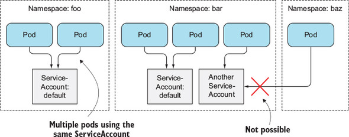
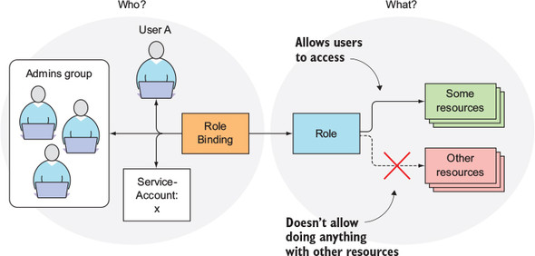
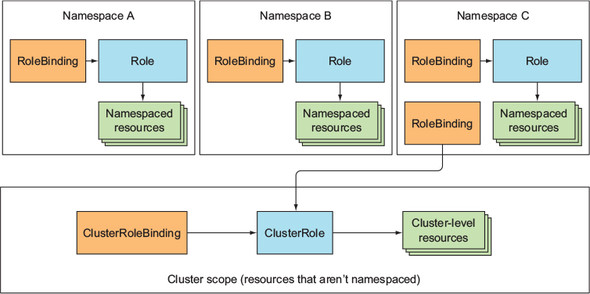
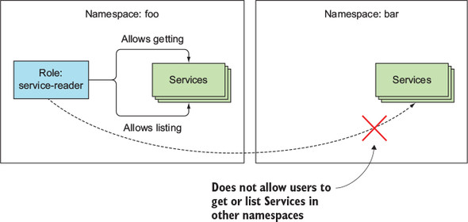
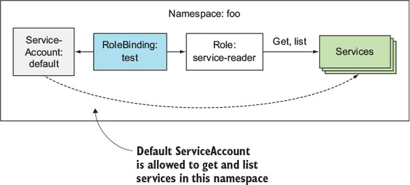
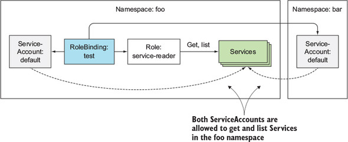
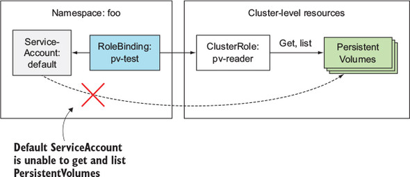
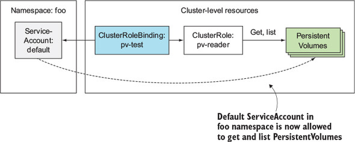
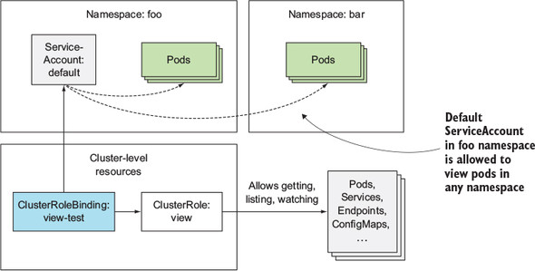

# Chapter 12. Securing the Kubernetes API server

## 12.1 Understanding Authentication

API 서버가 요청을 받으면 인증 플러그인을 거쳐서 적합한 실행 권한을 가지고 있는지 확인 

클라이언트 신원 확인 방법

* 클라이언트 인증서
* HTTP Header 에 포함되어 있는 인증 토큰
* Basic HTTP 인증
* 그 외

#### 12.1.1. Users and groups

API 서버에 접속하는 두 가지 유형의 클라이언트

* 사용자
* Pod (Application)

사용자는 Single Sign On 등의 방식을 이용해 인증 가능
Pod 는 클러스터 내에 생성한 ServiceAccount 를 통해 인증

Kubernetes 내에는 사용자 계정을 표현하는 자원은 존재하지 않음
그렇기 때문에 API 서버를 통해서 사용자 계정을 생성하거나 삭제하는 작업을 할 수 없음

사용자와 ServiceAccount 는 하나 이상의 그룹에 속할 수 있으며, 
그룹은 여러 사용자에게 권한을 한번에 주는 용도로 사용

**특별 (Built-in) 그룹**

| 그룹 이름                          | 목적                                           |
| ---------------------------------- | ---------------------------------------------- |
| system:unauthenticated             | 인증되지 않은 클라이언트들이 속한 그룹         |
| system:authenticated               | 인증 과정을 거친 클라이언트들이 속한 그룹      |
| system:serviceaccounts             | ServiceAccount 들이 속한 그룹                  |
| system:serviceaccounts:*namespace* | 특정 Namespace 에 속해있는 ServiceAccount 그룹 |

#### 12.1.2. Introducing ServiceAccounts

Pod 안에 있는 컨테이너는 ServiceAccount 의 인증 토큰을 API 서버로 보내 인증 진행
인증 토큰 위치: `/var/run/secrets/kubernetes.io/serviceaccount/token`

인증 토큰을 받은 API 서버는 인증 플러그인에 토큰을 전달하고 결과로 ServiceAccount 사용자 이름을 받아옴
토큰에서 얻은 ServiceAccount 사용자 이름을 다시 인증 플러그인에 전달하여, 실행하려는 작업에 충분한 권한을 가지고 있는지 확인

ServiceAccount 사용자 이름 형식:
`system:serviceaccount:**[namespace]**:**[service account name]**

Namespace 를 생성하면 *default* ServiceAccount 를 생성

ServiceAccount 확인 방법

```bash
$ kubectl get sa
NAME             SECRETS   AGE
default          1         26d
```

Namespace 안에 있는 ServiceAccount 는 여러 Pod 에 연결될 수 있지만, 다른 Namespace 있는 ServiceAccount 를 연결하는 것은 불가능



Pod 를 생성할 때 ServiceAccount 이름을 명시적으로 지정하지 않을 경우에는 *default* ServiceAccount 사용

#### 12.1.3. Creating ServiceAccounts

ServiceAccount 생성하기

```bash
$ kubectl create sa foo
serviceaccount/foo created
```

ServiceAccount 상세 정보

```bash
$ kubectl describe sa foo
Name:                foo
Namespace:           default
Labels:              <none>
Annotations:         <none>
Image pull secrets:  <none>            (1)
Mountable secrets:   foo-token-8jzf4   (2)
Tokens:              foo-token-8jzf4   (3)
Events:              <none>
```

(1) 이 ServiceAccount 를 사용하는 Pod 에 자동으로 추가될 *ImagePullSecrets*

(2) **kubernetes.io/enforce-mountable-secrets="true"** Annotation 이 설정되어 있을 경우에는 Pod 에서 해당 Secrets 객체만 mount 가능

(3) 인증 토큰 목록

토큰 안에는 CA 인증서, Namespace, JWT Token 이 존재

```bash
$ kubectl describe secret foo-token-8jzf4
Name:         foo-token-8jzf4
Namespace:    default
...
Data
====
ca.crt:     1025 bytes
namespace:  7 bytes
token:      eyJhbGciOiJSUzI1NiIsImtpZCI6IiJ9.....
```

ServiceAccount 에 ImagePullSecrets 목록을 지정하여 해당 ServiceAccount 를 사용하는 모든 Pod 에 자동으로 추가되도록 하는 것이 가능

```yaml
apiVersion: v1
kind: ServiceAccount
metadata:
  name: my-service-account
imagePullSecrets:
- name: my-dockerhub-secret
```

imagePullSecrets 항목을 추가하여 개별 Pod 에 일일이 추가하는 귀찮음을 줄일 수 있음

#### 12.1.4. Assigning a ServiceAccount to a pod

Pod 에 ServiceAccount 를 할당하기 위해서는 **spec.serviceAccountName** 필드에 이름 지정

```yaml
apiVersion: v1
kind: Pod
metadata:
  name: curl-custom-sa
spec:
  serviceAccountName: foo
  containers:
  - name: main
    image: tutum/curl
    command: ["sleep", "9999999"]
  - name: ambassador
    image: luksa/kubectl-proxy:1.6.2
```

Pod 를 생성할 때 지정한 ServiceAccount 는 수정할 수 없음

```bash
$ kubectl apply -f curl-custom-sa.yaml
pod/curl-custom-sa created
$ kubectl get po
NAME                                       READY   STATUS              RESTARTS   AGE
curl-custom-sa                             0/2     ContainerCreating   0          4s
```

*Foo* ServiceAccount 가 가지고 있던 Token 정보와 맞는지 확인

```bash
$ kubectl exec -it curl-custom-sa -c main cat /var/run/secrets/kubernetes.io/serviceaccount/token
eyJhbGciOiJSUzI1NiIsImtpZCI6IiJ9....
```

API 서버에 Pod 정보 요청

```bash
$ kubectl exec -it curl-custom-sa -c main curl localhost:8001/api/v1/pods
{
  "kind": "Status",
  "apiVersion": "v1",
  "metadata": {

  },
  "status": "Failure",
  "message": "pods is forbidden: User \"system:serviceaccount:default:foo\" cannot list resource \"pods\" in API group \"\" at the cluster scope",
  "reason": "Forbidden",
  "details": {
    "kind": "pods"
  },
  "code": 403
}
```

foo ServiceAccount 에 해당 자원을 조회할 권한이 없기 때문에 API 접근 실패

## 12.2. Securing the cluster with Role-Based Access Control

Kubernetes 1.8.0 에 GA 된 RBAC 플러그인은 권한없는 사용자가 클러스터 상태를 보거나 수정하는 것을 막아 클러스터 보안 향상

#### 12.2.1. Introducing the RBAC authorization plugin

사용자는 HTTP 요청을 API 서버에 보내어 원하는 액션을 수행하고, RBAC 플러그인은 클라이언트에 해당 액션을 수행하는 것이 허가되어 있는지 확인

| HTTP method | Verb for single resource     | Verb for collection |
| ----------- | ---------------------------- | ------------------- |
| GET, HEAD   | get (and watch for watching) | list (and watch)    |
| POST        | create                       | n/a                 |
| PUT         | update                       | n/a                 |
| PATCH       | patch                        | n/a                 |
| DELETE      | delete                       | deletecollection    |

RBAC 플러그인은 액션에 대상이 되는 자원에 대해서도 접근할 수 있는지 확인

#### 12.2.2. Introducing RBAC resources

RBAC 인증 규칙은 4 종류 자원을 두 그룹으로 나눠 구성

* Roles, ClusterRoles: 액션을 어떤 자원에 대해서 수행할 수 있는지
* RoleBindings, ClusterRoleBindings: Roles, ClusterRoles 를 그룹 혹은 ServiceAccount 에 연결



* Role, RoleBinding 은 Namespace 안에 있는 자원에 대한 접근 제어
* ClusterRole, ClusterRoleBinding 은 클러스터 단위로 접근할 수 있는 자원에 대한 접근 제어



RBAC 를 직접 설정해보며 알아보기 위해 Namespace 를 생성하고 Pod 배포

```bash
$ kubectl create ns foo
namespace/foo created
$ kubectl run test --image=luksa/kubectl-proxy -n foo
kubectl run --generator=deployment/apps.v1 is DEPRECATED and will be removed in a future version. Use kubectl run --generator=run-pod/v1 or kubectl create instead.
deployment.apps/test created
$ kubectl create ns bar
namespace/bar created
$ kubectl run test --image=luksa/kubectl-proxy -n bar
kubectl run --generator=deployment/apps.v1 is DEPRECATED and will be removed in a future version. Use kubectl run --generator=run-pod/v1 or kubectl create instead.
deployment.apps/test created
```

생성한 Pod 확인

```bash
$ kubectl get po -n foo
NAME                    READY   STATUS    RESTARTS   AGE
test-866d8cfcf4-hnbn8   1/1     Running   0          10m
$ kubectl get po -n bar
NAME                    READY   STATUS    RESTARTS   AGE
test-866d8cfcf4-s2prv   1/1     Running   0          9m31s
```

Pod 안에서 curl 명령을 이용해 서버 API 에 접근

```bash
$ kubectl exec -it test-866d8cfcf4-hnbn8 -n foo sh
/ # curl localhost:8001/api/v1/namespaces/foo/services
{
  "kind": "Status",
  "apiVersion": "v1",
  "metadata": {

  },
  "status": "Failure",
  "message": "services is forbidden: User \"system:serviceaccount:foo:default\" cannot list resource \"services\" in API group \"\" in the namespace \"foo\"",
  "reason": "Forbidden",
  "details": {
    "kind": "services"
  },
  "code": 403
}
```

기본값으로 사용하고 있는 *default* ServiceAccount 로는 접근이 불가능한 것 확인

#### 12.2.3. Using Roles and RoleBindings

Role 자원을 생성해 *foo* namespace 안에 있는 Services 자원에 대해 **get** and **list** 액션을 허용

```yaml
apiVersion: rbac.authorization.k8s.io/v1
kind: Role
metadata:
  namespace: foo              (1)
  name: service-reader
rules:
- apiGroups: [""]             (2)
  verbs: ["get", "list"]      (3)
  resources: ["services"]     (4)
```

(1) Role 이 속한 namespace

(2) Services 는 core apiGroup 에 속해있으며 이름이 없음 => "" 으로 표시

(3) "get", "list" 액션 허용

(4) 해당 Role 은 services 와 관련된어 있음 (복수형 사용)

service-reader Role 은 foo namespace 안에 있는 자원에 접근할 수 있지만, bar namespace 안에 있는 services 자원에는 접근할 수 없음



service-reader Role 생성

```bash
$ kubectl create -f service-reader.yaml -n foo
role.rbac.authorization.k8s.io/service-reader created
```

Role 을 *default* ServiceAccount 에 연결하기 위해 RoleBinding 자원 생성

```bash
$ kubectl create rolebinding test --role=service-reader \
  --serviceaccount=foo:default -n foo
rolebinding.rbac.authorization.k8s.io/test created
```

RoleBinding 이 *default* ServiceAccount 와 service-reader Role 을 연결하는 과정



생성한 RoleBinding 을 YAML 형식으로 표시

```yaml
$ kubectl get rolebinding test -n foo -o yaml
apiVersion: rbac.authorization.k8s.io/v1
kind: RoleBinding
metadata:
  name: test
  namespace: foo
  ...
roleRef:
  apiGroup: rbac.authorization.k8s.io
  kind: Role                            (1)
  name: service-reader                  (1)
subjects:
- kind: ServiceAccount                  (2)
  name: default                         (2)
  namespace: foo                        (2)
```

(1) RoleBinding 이 참조하는 service-reader Role

(2) foo namespace 에 있는 *default* ServiceAccount 에 연결

RoleBinding 은 항상 하나의 Role 만을 참조할 수 있지만, 여러 *subjects* 를 지정하는 것 가능

RoleBinding 을 생성해 Role 을 *foo* namespace 안에 있는 ServiceAccount 에 연결하였기 때문에 Pod 에서 Services 자원을 조회하는 것이 가능

```bash
/ # curl localhost:8001/api/v1/namespaces/foo/services
{
  "kind": "ServiceList",
  "apiVersion": "v1",
  "metadata": {
    "selfLink": "/api/v1/namespaces/foo/services",
    "resourceVersion": "465358"
  },
  "items": []               (1)
}/ #
```

(1) *items* 리스트가 비어있는 건 Services 자원이 없기 때문

*foo* namespace 안에 있는 RoleBinding 을 수정해 다른 Pod 의 ServiceAccount 에서 *foo* namespace 안에 있는 Services 자원에 접근할 수 있도록 변경 가능

```yaml
...
subjects:
- kind: ServiceAccount
  name: default
  namespace: bar
```

아래 명령을 수행해 변경

```bash
$ kubectl edit rolebinding test -n foo
...
rolebinding.rbac.authorization.k8s.io/test edited
```

*bar* namespace 안에 있는 Pod 에서  *foo* namespace 자원에 접근 가능

```bash
$ kubectl get po -n bar
NAME                    READY   STATUS    RESTARTS   AGE
test-866d8cfcf4-cfmqw   1/1     Running   0          3h17m
$ kubectl exec -it test-866d8cfcf4-cfmqw -n bar sh
/ # curl localhost:8001/api/v1/namespaces/bar/services
{
  "kind": "Status",
  "apiVersion": "v1",
  "metadata": {

  },
  "status": "Failure",
  "message": "services is forbidden: User \"system:serviceaccount:bar:default\" cannot list resource \"services\" in API group \"\" in the namespace \"bar\"",
  "reason": "Forbidden",
  "details": {
    "kind": "services"
  },
  "code": 403
/ # curl localhost:8001/api/v1/namespaces/foo/services
{
  "kind": "ServiceList",
  "apiVersion": "v1",
  "metadata": {
    "selfLink": "/api/v1/namespaces/foo/services",
    "resourceVersion": "469246"
  },
  "items": []
}
```

*foo* namespace 안에 있는 RoleBinding 은 같은 namespace 안에 있는 **service-reader** Role 과 *default* ServiceAccount 를 서로 연결
이 때, *foo* 와 *bar* 에 있는 ServiceAccount 를 모두 연결하기 때문에 각 Pod 는 *foo* namespace 안에 있는 Services 자원을 조회할 수 있음



#### 12.2.4. Using ClusterRoles and ClusterRoleBindings

Role 과 RoleBinding 은 하나의 Namespace 안에 존재하는 자원이지만, RoleBinding 은 다른 Namespace 에 있는 ServiceAccounts 를 지정하는 것이 가능

Namespace 에 속하지 않는 ClusterRole 과 ClusterRoleBinding 두 가지 RBAC 자원이 존재

기본적으로 Role 은 같은 namespace 에 있는 자원에 접근하는 것을 허가
만약에 다른 namespace 에 있는 자원에 접근하고자 한다면 Role 과 RoleBinding 을 namespace 마다 생성해야함

또한 Roles 를 통해서 접근할 수 없는 자원이 존재

* Namespace 에 속하지 않는 자원들(Nodes, PersistentVolumes, Namespaces 등)
* API 서버를 통해 전급할 수는 있지만, 자원을 나타내지 않는 형태의 URL (/healthz 등)

ClusterRole 은 클러스터 레벨 자원으로 Namespace 에 속하지 않는 자원이나 자원을 나타내지 않는 형태의 URL 에 접근할 수 있음
그리고 Namespace 마다 개별적인 Role,  RoleBinding 을 생성해야하는 것을 줄여줌

PersistentVolume 을 조회할 수 있는 ClusterRole 생성

```bash
$ kubectl create clusterrole pv-reader --verb=get,list --resource=persistentvolumes
clusterrole.rbac.authorization.k8s.io/pv-reader created
```

ClusterRole 세부 내용

```yaml
$ kubectl get clusterrole pv-reader -o yaml
apiVersion: rbac.authorization.k8s.io/v1
kind: ClusterRole
metadata:                                                              (1)
  name: pv-reader                                                      (1)
  resourceVersion: "475874"                                            (1)
  selfLink: /apis/rbac.authorization.k8s.io/v1/clusterroles/pv-reader  (1)
  uid: e26bdd00-8166-11e9-b03c-309c231764ec                            (1)
rules:
- apiGroups:                                                           (2)
  - ""                                                                 (2)
  resources:                                                           (2)
  - persistentvolumes                                                  (2)
  verbs:                                                               (2)
  - get                                                                (2)
  - list
```

(1) ClusterRole 은 Namespace 에 종속되지 않기 때문에 namespace 필드가 존재하지 않음

(2) Role 에서 사용하는 규칙과 동일한 형태

현재 ServiceAccount 에 연결된 Pod 에서 PersistentVolumes 자원을 볼 수 있는지 확인

```bash
$ kubectl exec -it test-866d8cfcf4-x7fxw -n foo sh
/ # curl localhost:8001/api/v1/persistentvolumes
{
  "kind": "Status",
  "apiVersion": "v1",
  "metadata": {

  },
  "status": "Failure",
  "message": "persistentvolumes is forbidden: User \"system:serviceaccount:foo:default\" cannot list resource \"persistentvolumes\" in API group \"\" at the cluster scope",
  "reason": "Forbidden",
  "details": {
    "kind": "persistentvolumes"
  },
  "code": 403
}
```

ClusterRole 을 ServiceAccount 와 연결하기 위해 RoleBindings 생성

```bash
$ kubectl create rolebinding pv-test --clusterrole=pv-reader --serviceaccount=foo:default -n foo
rolebinding.rbac.authorization.k8s.io/pv-test created
```

PersistentVolumes 자원을 읽을 수 있는지 확인

```bash
# curl localhost:8001/api/v1/persistentvolumes
{
  "kind": "Status",
  "apiVersion": "v1",
  "metadata": {

  },
  "status": "Failure",
  "message": "persistentvolumes is forbidden: User \"system:serviceaccount:foo:default\" cannot list resource \"persistentvolumes\" in API group \"\" at the cluster scope",
  "reason": "Forbidden",
  "details": {
    "kind": "persistentvolumes"
  },
  "code": 403
}
```

앞에서 생성한 RoleBinding 자원 내용 확인

```yaml
$ kubectl get rolebinding pv-test -o yaml -n foo
apiVersion: rbac.authorization.k8s.io/v1
kind: RoleBinding
metadata:
  creationTimestamp: "2019-05-28T17:03:32Z"
  name: pv-test
  namespace: foo
  resourceVersion: "477784"
  selfLink: /apis/rbac.authorization.k8s.io/v1/namespaces/foo/rolebindings/pv-test
  uid: 860582c6-816a-11e9-b03c-309c231764ec
roleRef:
  apiGroup: rbac.authorization.k8s.io
  kind: ClusterRole                        (1)
  name: pv-reader                          (1)
subjects:
- kind: ServiceAccount                     (2)
  name: default                            (2)
  namespace: foo                           (2)
```

(1) pv-reader ClusterRole 지정

(2) *foo* namespace 안에 있는 *default* ServiceAccount 에 연결



위 결과를 보면 클러스터 전역에 영향을 주는 자원인 경우에는 ClusterRoleBinding 을 사용해야함

기존에 생성한 RoleBinding 을 지우고 ClusterRoleBinding 생성

```bash
$ kubectl delete rolebinding pv-test -n foo
rolebinding.rbac.authorization.k8s.io "pv-test" deleted(base)
$ kubectl create clusterrolebinding pv-test --clusterrole=pv-reader --serviceaccount=foo:default
clusterrolebinding.rbac.authorization.k8s.io/pv-test created
```



Pod 안에서 PersistentVolumes 을 볼 수 있는지 확인

```json
/ # curl localhost:8001/api/v1/persistentvolumes
{
  "kind": "PersistentVolumeList",
  "apiVersion": "v1",
  "metadata": {
    "selfLink": "/api/v1/persistentvolumes",
    "resourceVersion": "479536"
  },
  "items": [
    {
      "metadata": {
      ...
```

미리 생성되어 있는 *system:discovery* ClusterRole 이 가지고 있는 규칙 확인

```yaml
$ kubectl get clusterrole system:discovery -o yaml
apiVersion: rbac.authorization.k8s.io/v1
kind: ClusterRole
metadata:
  annotations:
    rbac.authorization.kubernetes.io/autoupdate: "true"
  labels:
    kubernetes.io/bootstrapping: rbac-defaults
  name: system:discovery
  selfLink: /apis/rbac.authorization.k8s.io/v1/clusterroles/system%3Adiscovery
rules:
- nonResourceURLs:       (1)
  - /api                 (1)
  - /api/*               (1)
  - /apis                (1)
  - /apis/*              (1)
  - /healthz             (1)
  - /openapi             (1)
  - /openapi/*           (1)
  - /version             (1)
  - /version/            (1)
  verbs:                 (2)
  - get                  (2)
```

(1) URL 형태로 표현되는 자원 목록

(2) HTTP GET 요청만 허용

*system:discovery* ClusterRoleBinding 을 통해 연결되는 내용 확인

```yaml
$ kubectl get clusterrolebinding system:discovery -o yaml
apiVersion: rbac.authorization.k8s.io/v1
kind: ClusterRoleBinding
metadata:
  name: system:discovery
  labels:
    kubernetes.io/bootstrapping: rbac-defaults
  ...
roleRef:
  apiGroup: rbac.authorization.k8s.io
  kind: ClusterRole                          (1)
  name: system:discovery                     (1)
subjects:
- apiGroup: rbac.authorization.k8s.io
  kind: Group                                (2)
  name: system:authenticated                 (2)
```

(1) *system:discovery* ClusterRole 연결

(2) *system:authenticated* Group 에 속해있는 사용자들에게 역할 부여

Group 에 속하기 위해서는 `kubectl proxy` 를 통해서 접근하거나 `Bearer Token` 을 HTTP 요청에 포함

그룹 안에 속해있지 않은 경우

```bash
$ curl https://$APISERVER:$APIPORT/api --insecure
{
  "kind": "Status",
  "apiVersion": "v1",
  "metadata": {

  },
  "status": "Failure",
  "message": "forbidden: User \"system:anonymous\" cannot get path \"/api\"",
  "reason": "Forbidden",
  "details": {

  },
  "code": 403
}
```

kubectl proxy 사용

```bash
$ kubectl proxy &
[1] 30431
$ Starting to serve on 127.0.0.1:8001

$ curl http://127.0.0.1:8001/api
{
  "kind": "APIVersions",
  "versions": [
    "v1"
  ],
  "serverAddressByClientCIDRs": [
    {
      "clientCIDR": "0.0.0.0/0",
      "serverAddress": "APISERVER:APIPORT"
    }
  ]
}
```

Bearer Token 사용

```bash
$ curl https://$APISERVER:$APIPORT/api -H "Authorization: Bearer $TOKEN" --insecure
{
  "kind": "APIVersions",
  "versions": [
    "v1"
  ],
  "serverAddressByClientCIDRs": [
    {
      "clientCIDR": "0.0.0.0/0",
      "serverAddress": "APISERVER:APIPORT"
    }
  ]
}
```

ClusterRole 은 ClusterRoleBinding 뿐만 아니라 RoleBinding 자원과도 연결 가능

*view* ClusterRole 을 통해 확인

```bash
$ kubectl get clusterrole view -o yaml
apiVersion: rbac.authorization.k8s.io/v1
kind: ClusterRole
metadata:
  name: view
  ...
rules:
- apiGroups:
  - ""
  resources:                             (1)
  - configmaps                           (1)
  - endpoints                            (1)
  - persistentvolumeclaims               (1)
  - pods                                 (1)
  - replicationcontrollers               (1)
  - replicationcontrollers/scale         (1)
  - serviceaccounts                      (1)
  - services                             (1)
  verbs:                                 (2)
  - get                                  (2)
  - list                                 (2)
  - watch                                (2)
  ...
```

(1) Namespace 에 속하는 자원 목록

(2) 자원에 대한 내용을 보는 것만 가능

*view* ClusterRole 을 ClusterRoleBinding 에 연결하면 전체 namespaces 안에 있는 자원을 보는 것이 가능해지고, RoleBinding 에 연결하면 특정 namespace 안에 있는 자원만 보는 것이 가능

먼저 현재 실행 중인 Pod 에서 pods 자원에 접근하지 못하는 것 확인

```bash
/ # curl http://localhost:8001/api/v1/pods
{
  "kind": "Status",
  "apiVersion": "v1",
  "metadata": {

  },
  "status": "Failure",
  "message": "pods is forbidden: User \"system:serviceaccount:foo:default\" cannot list resource \"pods\" in API group \"\" at the cluster scope",
  "reason": "Forbidden",
  "details": {
    "kind": "pods"
  },
  "code": 403
}/ # curl http://localhost:8001/api/v1/namespaces/foo/pods
{
  "kind": "Status",
  "apiVersion": "v1",
  "metadata": {

  },
  "status": "Failure",
  "message": "pods is forbidden: User \"system:serviceaccount:foo:default\" cannot list resource \"pods\" in API group \"\" in the namespace \"foo\"",
  "reason": "Forbidden",
  "details": {
    "kind": "pods"
  },
  "code": 403
}
```

ClusterRoleBinding 을 이용해 *view* ClusterRole 과 *foo:default ServiceAccount* 연결

```bash
$ kubectl create clusterrolebinding view-test --clusterrole=view --serviceaccount=foo:default
clusterrolebinding.rbac.authorization.k8s.io/view-test created
```

*foo* namespace 에 있는 pod 목록 확인

```bash
/ # curl http://localhost:8001/api/v1/namespaces/foo/pods
{
  "kind": "PodList",
  "apiVersion": "v1",
  "metadata": {
    "selfLink": "/api/v1/namespaces/foo/pods",
    "resourceVersion": "486953"
  },
  "items": [
    {
      "metadata": {
        "name": "test-866d8cfcf4-x7fxw",
        "namespace": "foo",
        ...
```

*bar* namespace 에 있는 pod 목록 확인

```bash
/ # curl http://localhost:8001/api/v1/namespaces/bar/pods
{
  "kind": "PodList",
  "apiVersion": "v1",
  "metadata": {
    "selfLink": "/api/v1/namespaces/bar/pods",
    "resourceVersion": "487048"
  },
  "items": [
    {
      "metadata": {
        "name": "test-866d8cfcf4-cfmqw",
        "namespace": "bar",
        ...
```

Namespace 전체에 있는 pod 목록 확인

```bash
/ # curl http://localhost:8001/api/v1/pods
{
  "kind": "PodList",
  "apiVersion": "v1",
  "metadata": {
    "selfLink": "/api/v1/pods",
    "resourceVersion": "487240"
  },
  "items": [
    {
    ...
```

*view* ClusterRole 을 ClusterRoleBinding 으로 연결한 pod 는 클러스터 전체에 있는 자원을 보는 것 가능



앞에서 생성한 ClusterRoleBinding 을 삭제하고 RoleBinding 을 이용해 연결

```bash
$ kubectl delete clusterrolebinding view-test
clusterrolebinding.rbac.authorization.k8s.io "view-test" deleted
$ kubectl create rolebinding view-test --clusterrole=view --serviceaccount=foo:default -n foo
rolebinding.rbac.authorization.k8s.io/view-test created
```

Pod 안에서 다시 pod 목록을 확인

```bash
/ # curl http://localhost:8001/api/v1/namespaces/foo/pods
{
  "kind": "PodList",
  "apiVersion": "v1",
  "metadata": {
    "selfLink": "/api/v1/namespaces/foo/pods",
    "resourceVersion": "487664"
  },
  "items": [
  ...
```

```bash
/ # curl http://localhost:8001/api/v1/namespaces/bar/pods
{
  "kind": "Status",
  "apiVersion": "v1",
  "metadata": {

  },
  "status": "Failure",
  "message": "pods is forbidden: User \"system:serviceaccount:foo:default\" cannot list resource \"pods\" in API group \"\" in the namespace \"bar\"",
  "reason": "Forbidden",
  "details": {
    "kind": "pods"
  },
  "code": 403
}
```

```bash
/ # curl http://localhost:8001/api/v1/pods
{
  "kind": "Status",
  "apiVersion": "v1",
  "metadata": {

  },
  "status": "Failure",
  "message": "pods is forbidden: User \"system:serviceaccount:foo:default\" cannot list resource \"pods\" in API group \"\" at the cluster scope",
  "reason": "Forbidden",
  "details": {
    "kind": "pods"
  },
  "code": 403
}
```

RoleBinding 을 이용해 *view* ClusterRole 과 연결하면 *foo* namespace 안에 있는 자원은 읽을 수 있지만, 다른 namespace 에 있는 자원은 읽을 수 없도록 변경됨


상황에 따라 사용할 Role 과 Binding 형식 조합

| For accessing                                                | Role type to use | Binding type to use |
| ------------------------------------------------------------ | ---------------- | ------------------- |
| Cluster-level resources (Nodes, PV, ...)                     | ClusterRole      | ClusterRoleBinding  |
| Non-resource URLs (/api, /healthz, ...)                      | ClusterRole      | ClusterRoleBinding  |
| Namespaced resources in any namespace                        | ClusterRole      | ClusterRoleBinding  |
| Namespaced resources in a specific namespace<br />(reusing the same ClusterRole in multiple namespaces) | ClusterRole      | RoleBinding         |
| Namespaced resources in a specific namespace<br />(Role must be defined in each namespace) | Role             | RoleBinding         |

#### 12.2.5. Understanding default ClusterRoles and ClusterRoleBindings

Kubernetes API 서버가 시작할 때마다 기본적인 ClusterRoles 와 ClusterRoleBindings 생성

```bash
$ kubectl get clusterrolebindings
NAME                                                   AGE
cluster-admin                                          29d
system:aws-cloud-provider                              29d
system:basic-user                                      29d
system:controller:attachdetach-controller              29d
system:controller:certificate-controller               29d
system:controller:clusterrole-aggregation-controller   29d
system:controller:cronjob-controller                   29d
system:controller:daemon-set-controller                29d
system:controller:deployment-controller                29d
...
```

```bash
$ kubectl get clusterrole
NAME                                                                   AGE
admin                                                                  29d
cluster-admin                                                          29d
edit                                                                   29d
system:aggregate-to-admin                                              29d
system:aggregate-to-edit                                               29d
system:aggregate-to-view                                               29d
system:auth-delegator                                                  29d
system:aws-cloud-provider                                              29d
system:basic-user                                                      29d
system:certificates.k8s.io:certificatesigningrequests:nodeclient       29d
system:certificates.k8s.io:certificatesigningrequests:selfnodeclient   29d
system:controller:attachdetach-controller                              29d
system:controller:certificate-controller                               29d
system:controller:clusterrole-aggregation-controller                   29d
...
system:node                                                            29d
system:node-bootstrapper                                               29d
system:node-problem-detector                                           29d
system:node-proxier                                                    29d
system:persistent-volume-provisioner                                   29d
system:public-info-viewer                                              29d
system:volume-scheduler                                                29d
view                                                                   29d
```

중요한 Role 에는 *view*, *edit*, *admin*, *cluster-admin* 등이 있고 각 Role 을 ServiceAccount 에 연결하여 Pod 안에서 사용 가능

*view* ClusterRole 은 Roles, RoleBindings, Secrets 을 제외한 자원을 볼 수 있음

*edit* ClusterRole 은 Roles, RoleBindings 를 제외한 자원을 보고 수정할 수 있음

*admin* ClusterRole 은 ResourceQuotas, Namespace 자체를 뺀 나머지 모든 자원을 보거나 수정할 수 있음

*cluster-admin* ClusterRole 은 클러스터 전체를 관리하는 것 가능

*system:* 으로 시작하는 ClusterRole 은 시스템 구성요소들이 맡은 역할을 수행하는 데 필요한 권한 지정

#### 12.2.6. Granting authorization permissions wisely

각 Pod 에서 사용할 ServiceAccount 를 생성하고 Role (혹은 ClusterRole) 과 RoleBinding 을 통해 연결

Pod 별로 필요한 권한이 다르면, 읽기 권한만을 가진 ServiceAccount / 쓰기 권한을 가진 ServiceAccount 를 각각 생성해 Pod 마다 다른 ServiceAccount 지정

