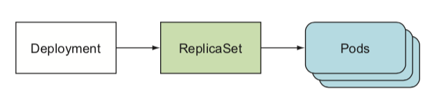
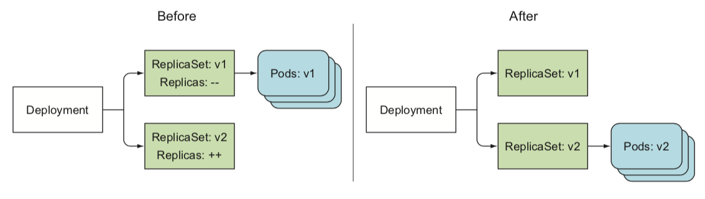
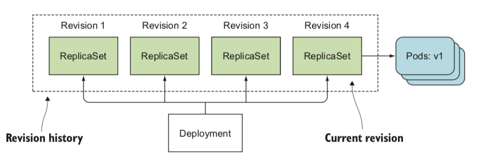
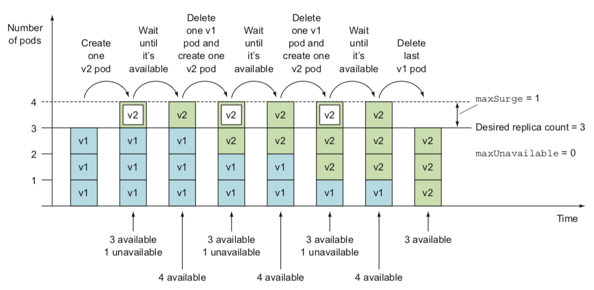
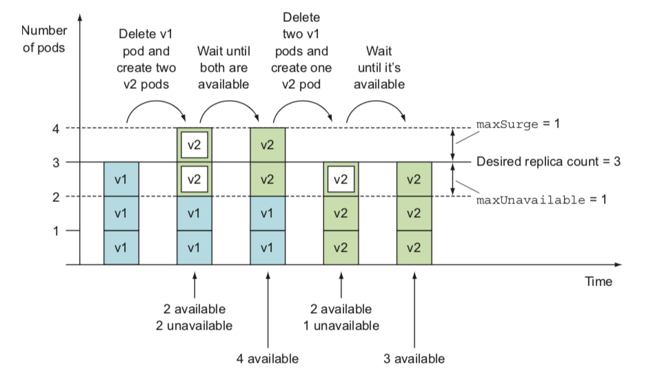
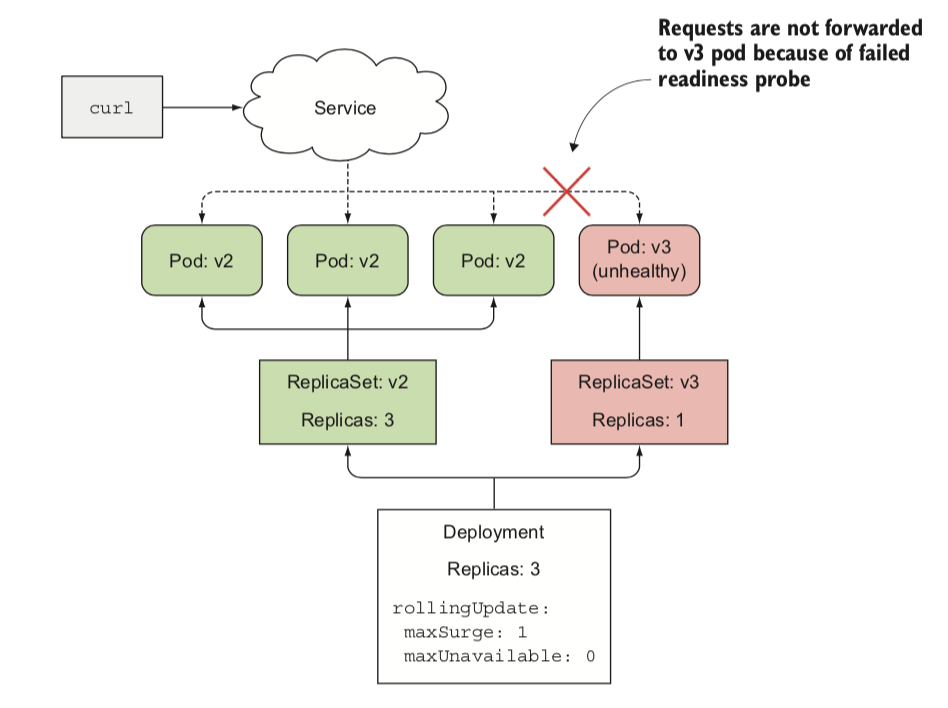

# Ch9. Deployments: updating applications declaratively

## Deployment
* Application을 배포하고 선언적으로 업데이트하는데 사용하는 상위 수준 리소스
* Deployment가 생성하는 ReplicaSet이 Pod를 관리



<br>

* 간단한 Deployment 설정
```yaml
apiVersion: apps/v1
kind: Deployment
metadata:
  name: kubia
spec:
  replicas: 3
  selector:
    matchLabels:
      app: kubia
  template:
    metadata:
      name: kubia
      labels:
        app: kubia
    spec:
      containers:
        - image: luksa/kubia:v1
          name: nodejs
```

* 생성
```sh
$ kubectl create -f kubia-deployment.yaml
```

<br>

## Replication Controller vs Deployment

### Replication Controller를 통한 업데이트
```sh
$ kubectl rolling-update
```
* 대체할 새로운 Replication Controller 이름 지정
* 새로운 Pod로 대체 후 기존 Replication Controller 삭제
* 터미널을 통해 kubectl이 동작
  * Network issue로 중간에 끊어질 수 있다

<br>

### Deployment를 통한 업데이트
```sh
$ kubectl apply -f kubbia-deployment-v2.yaml
```

* Pod template만 수정하면 된다
* kubectl이 아닌 Control Plane에서 처리


<br>

## Deployment Strategy
* RollingUpdate
  * 오래된 Pod을 하나씩 제거하는 동시에 새로운 Pod를 추가
  * 업데이트 프로세스 중 application 사용 가능
  * application이 이전 버전과 새 버전을 동시에 사용할 수 있는 경우 사용
* Recreate
  * 기존 Pod 모두 삭제 후 새로운 Pod 생성
  * 업데이트 프로세스 중 일시적으로 application을 사용할 수 없다
  * application이 이전 버전과 새 버전을 동시에 사용할 수 없는 경우 사용


<br> 

### Rolling update 확인
* 주기적으로 서비스를 호출해서 변경 확인
```sh
$ while true; do curl http://130.211.109.222; sleep 1; done

This is v1 running in pod kubia-1581283744-p9vh2
This is v2 running in pod kubia-6969c946dc-xhqrf
This is v1 running in pod kubia-1581283744-sfgqk
...
```
> Pod의 이름은 ReplicaSet에 포함된 hash 사용

<br>



* 업데이트 이후 ReplicaSet
```sh
$ kuectl get rs

NAME               DESIRED   CURRENT   READY     AGE
kubia-6969c946dc    1         1         1         23m
kubia-1581283744    0         0         0         25m
```
* Replication Controller과는 다르게 기존의 ReplicaSet은 남아 있다
  * Rollback에 사용
* 단일 Deployment를 관리하는 것이 여러 ReplicationController를 관리하는 것보다 훨씬 간단


<br>

## Deployment Rollback

### Rollout Status 확인
* rollout 진행 상황을 확인할 수 있다
```sh
$ kubectl rollout status deployment <deployment name>

## example
$ kubectl rollout status deployment kubia
Waiting for rollout to finish: 1 out of 3 new replicas have been updated...
Waiting for rollout to finish: 2 out of 3 new replicas have been updated...
Waiting for rollout to finish: 1 old replicas are pending termination...
deployment "kubia" successfully rolled out
```


### 잘못된 rollout을 수동으로 차단
* Deployment의 마지막 rollout을 취소
* rollout 중에는 이미 생성된 Pod가 제거되고, 이전 Pod로 교체
```sh
$ kubectl rollout undo deployment <deployment name>

## example
$ kubectl rollout undo deployment kubia
deployment "kubia" rolled back
```


### Deployment Rollout history
```sh
$ kubectl rollout history deployment <deployment name>

## example
$ kubectl rollout history deployment kubia
deployments "kubia"
REVISION  CHANGE-CAUSE
1         <none>
2         <none>
...
```

> Deployment 생성시 `--record`를 사용하면 CHANGE-CAUSE에서 실행한 명령어를 확인할 수 있어 파악하기 쉽다
> ```
> $ kubectl rollout history deployment kubia
> deployments "kubia"
> REVISION  CHANGE-CAUSE
> ...
> 2         kubectl set image deployment kubia nodejs=luksa/kuiba:v2
> ```


### 특정 Deployment revision으로 rollback
```sh
$ kubectl rollout undo deployment <deployment name> --to-revision=<revision number>

## example - 1번째 revision으로 rollback
$ kubectl rollout undo deployment kubia --to-revision=1
```


#### ReplicaSet은 Deployment의 revision history를 의미



* Deployment에 의해 생성된 모든 ReplicaSet은 특정 Revision의 Deployment의 전체 정보를 저장
* 수동으로 삭제하면 revision을 잃어버리게 되어 rollback할 수 없다
* `spec.revisionHistoryLimit`으로 revision history 제한 설정
  * default. 10
  * 무한정 저장할 수 없으므로 이전 revision은 자동으로 삭제


#### Rolling Update Rollout 속도 통제
`maxSurge`, `maxUnavailable`로 제어
```yaml
spec:
  strategy:
    type: RollingUpdate
    rollingUpdate:
      maxSurge: 1
      maxUnavailable: 0
```
* maxSurge
  * 지정한 replica 개수를 초과할 수 있는 Pod 수
  * 비율 or 절대값으로 설정(default. 25%)
* maxUnavailable
  * 지정한 replica 개수 대비 사용할 수 없는 Pod 수
  * 비율 or 절대값으로 설정(default. 25%)

* e.g. replicas=3, maxSurge=1, maxUnavailable=0


* e.g. replicas=3, maxSurge=1, maxUnavailable=1



<br>

## Rollout 프로세스 일시 중지
* rollout 중 일부만 업데이트하고 싶은 경우 추가 Deployment를 이용해 구성할 수 있지만 `pause`로도 할 수 있다
* 새 버전의 동작을 검증할 수 있다
  * Canary Deploy

### 중지
```sh
$ kubectl rollout pause deployment <deployment name>

## example
$ kubectl rollout pause deployment kubia
```

### 재개
```sh
$ kubectl rollout resume deployment <deployment name>

## example
$ kubectl rollout resume deployment kubia
```


<br>

### 잘못된 버전 rollout 방지
* `minReadySeconds`와 `readinessProbe`를 이용
* minReadySeconds
  * 새로운 Pod가 사용 가능한 상태로 전환하기 전 준비 상태로 머물 기간
  * 배포 속도를 저하시켜 오작동하는 버전의 배포를 방지
    * maxUnavailable로 인해
  * minReadySeconds가 지나기 전에 readinessProbe가 실패하면 rollout 차단

```yaml
apiVersion: apps/v1
kind: Deployment
metadata:
  name: kubia
spec:
  replicas: 3
  minReadySeconds: 10  # here
  strategy:
    rollingUpdate:
      maxSurge: 1
      maxUnavailable: 0  # here
    type: RollingUpdate
  template:
    metadata:
      name: kubia
      labels:
        app: kubia
    spec:
      containers:
      - image: lukas/kubia:v3
        name: nodejs
        readinessProbe:
          periodSeconds: 1  # here
          httpGet:
            path: /
            port: 8080
```



* 새로운 Pod을 사용할 수 없어서 rollout은 진행되지 않는다


<br>

### Rollout deadline
* rollout이 일정시간 안에 진행되지 않으면 실패로 간주
* `spec.progressDeadlineSeconds`로 설정
  * default. 600

```yaml
apiVersion: apps/v1
kind: Deployment
metadata:
  name: kubia
spec:
  minReadySeconds: 60
  progressDeadlineSeconds: 600  # here
```

<br>

### Rollout 취소
```sh
$ kubectl rollout undo deployment <deployment name>

## example
$ kubectl rollout undo deployment kubia
```
